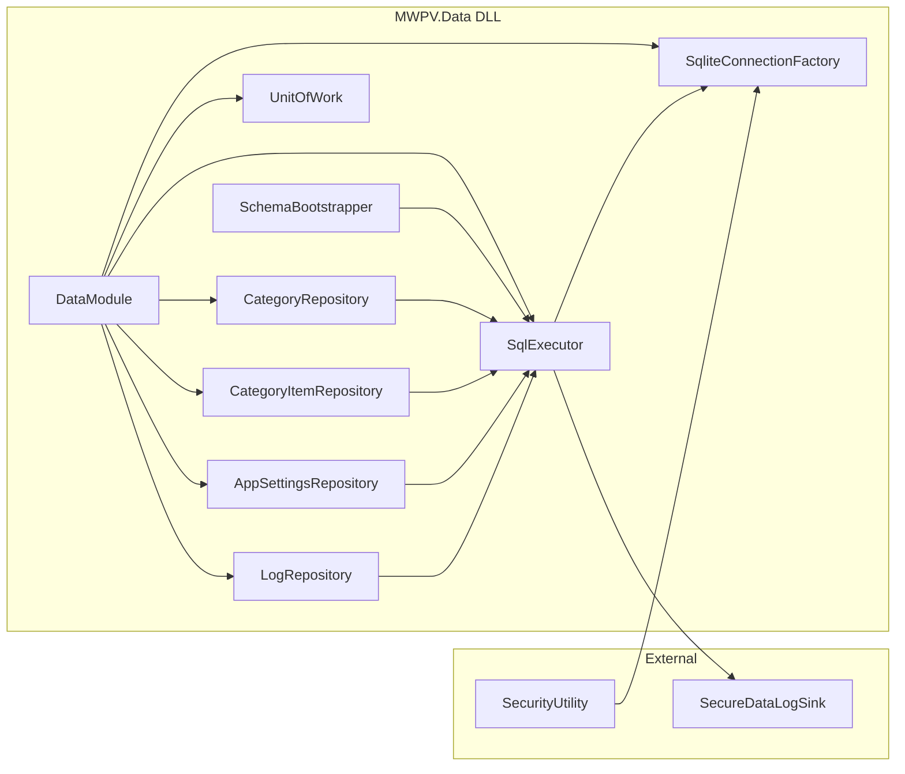

```mermaid
flowchart LR

subgraph DataDLL [MWPV.Data DLL]
    DM[DataModule]
    CF[SqliteConnectionFactory]
    EX[SqlExecutor]
    SB[SchemaBootstrapper]
    UoW[UnitOfWork]
    CR[CategoryRepository]
    CIR[CategoryItemRepository]
    AR[AppSettingsRepository]
    LR[LogRepository]
end

subgraph External [External]
    SECUTIL[SecurityUtility]
    SECLOG[SecureDataLogSink]
end

%% Connections
DM --> CF
DM --> EX
DM --> CR
DM --> CIR
DM --> AR
DM --> LR
DM --> UoW

SB --> EX
EX --> CF
EX --> SECLOG

CR --> EX
CIR --> EX
AR --> EX
LR --> EX

SECUTIL --> CF
```
