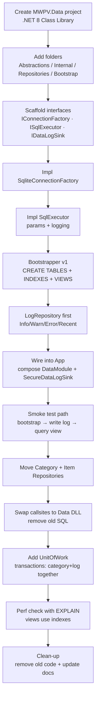

```mermaid
flowchart TB
  A[Create MWPV.Data project\n.NET 8 Class Library] --> B[Add folders\nAbstractions / Internal / Repositories / Bootstrap]
  B --> C[Scaffold interfaces\nIConnectionFactory · ISqlExecutor · IDataLogSink]
  C --> D[Impl SqliteConnectionFactory]
  D --> E[Impl SqlExecutor\nparams + logging]
  E --> F[Bootstrapper v1\nCREATE TABLES + INDEXES + VIEWS]
  F --> G[LogRepository first\nInfo/Warn/Error/Recent]
  G --> H[Wire into App\ncompose DataModule + SecureDataLogSink]
  H --> I[Smoke test path\nbootstrap → write log → query view]
  I --> J[Move Category + Item Repositories]
  J --> K[Swap callsites to Data DLL\nremove old SQL]
  K --> L[Add UnitOfWork\ntransactions: category+log together]
  L --> M[Perf check with EXPLAIN\nviews use indexes]
  M --> N[Clean-up\nremove old code + update docs]
```
