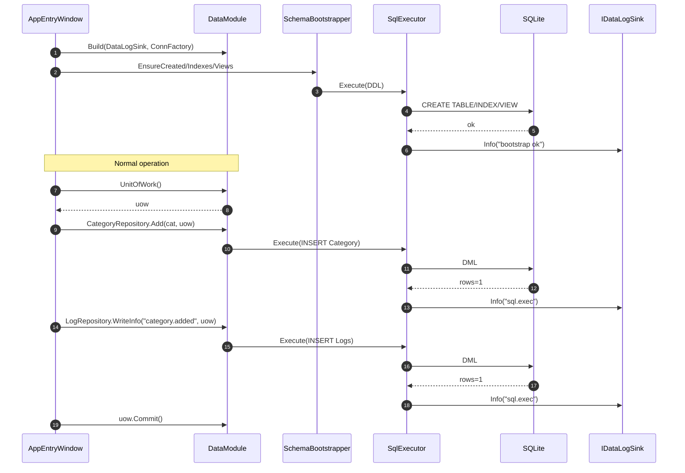

```mermaid
sequenceDiagram
autonumber
participant App as AppEntryWindow
participant DM as DataModule
participant SB as SchemaBootstrapper
participant EX as SqlExecutor
participant DB as SQLite
participant LS as IDataLogSink

App->>DM: Build(DataLogSink, ConnFactory)
App->>SB: EnsureCreated/Indexes/Views
SB->>EX: Execute(DDL)
EX->>DB: CREATE TABLE/INDEX/VIEW
DB-->>EX: ok
EX->>LS: Info("bootstrap ok")

note over App,DM: Normal operation

App->>DM: UnitOfWork()
DM-->>App: uow
App->>DM: CategoryRepository.Add(cat, uow)
DM->>EX: Execute(INSERT Category)
EX->>DB: DML
DB-->>EX: rows=1
EX->>LS: Info("sql.exec")

App->>DM: LogRepository.WriteInfo("category.added", uow)
DM->>EX: Execute(INSERT Logs)
EX->>DB: DML
DB-->>EX: rows=1
EX->>LS: Info("sql.exec")

App->>DM: uow.Commit()
```
