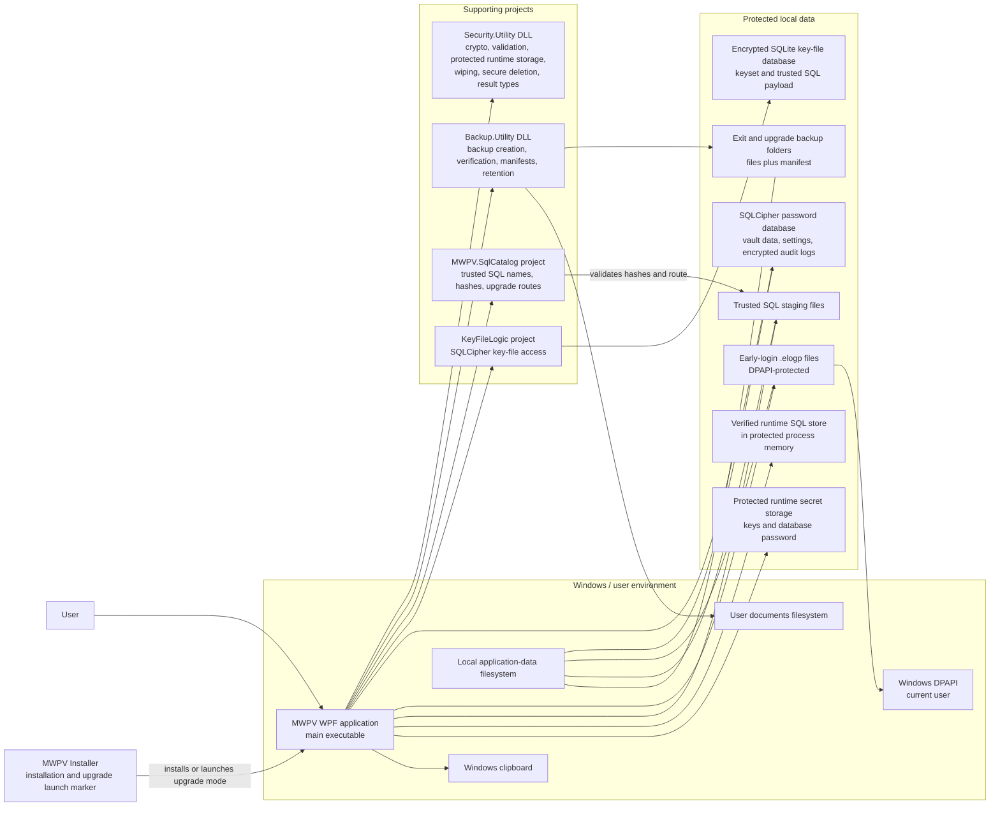
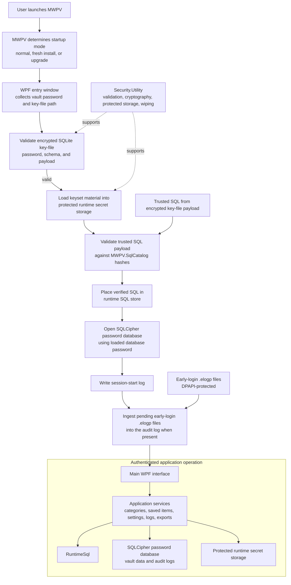
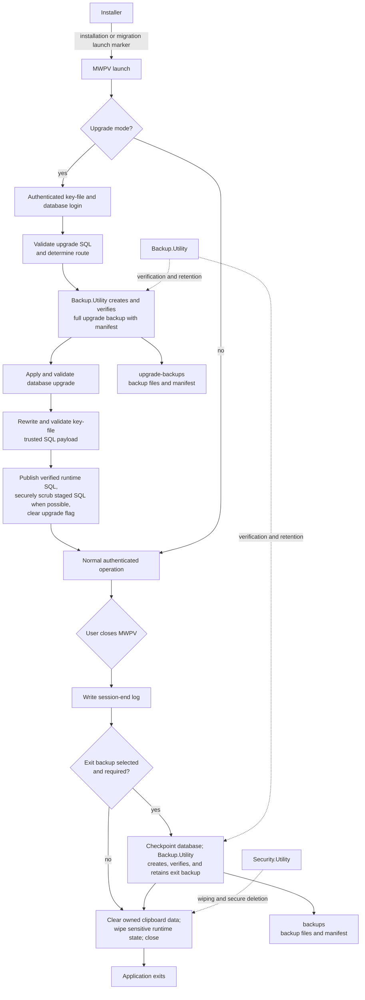

# MWPV High-Level Architecture and Flow

## Purpose and Scope

This document gives a deliberately broad view of the MWPV WPF application's authenticated startup, runtime, upgrade, backup, and shutdown responsibilities. It reflects the current solution structure and runtime paths; it is not a class or method-level design.

## System Context

## Startup and Normal Runtime Flow

## Upgrade, Backup, and Shutdown Flow

## Component Responsibilities

| Component | High-level responsibility |
|---|---|
| MWPV | WPF entry, startup-mode selection, authenticated runtime, application services, session logging, and shutdown coordination. |
| Security.Utility | Cryptographic helpers, validation results, protected in-process secret storage, sensitive-data wiping, and secure-deletion support. |
| Backup.Utility | Creates and verifies backup sets, writes and verifies manifests, restores where invoked, and applies retention. |
| SQL catalog/runtime SQL components | `MWPV.SqlCatalog` defines trusted SQL hashes and upgrade routes; MWPV validates SQL and exposes only verified SQL through the runtime store. |
| Password database | SQLCipher `MWPV.db` contains vault application data, settings, and audit logs. |
| Key-file database | Encrypted SQLite key-file database stores the keyset payload, including the database password, runtime keys, and trusted SQL payload. |
| Logging | Session and audit logs are written through the application log service to the password database; pre-authentication failures are DPAPI-protected `.elogp` files and are ingested after successful login. |
| Installer | Installs the published application and, for an update migration, launches MWPV with the migration marker that selects upgrade mode. |

## Important Boundaries

- **Password and key-file authentication boundary:** the entry flow validates the encrypted key-file password, schema, and payload before using its keyset to open the password database.
- **Trusted SQL integrity boundary:** SQL is accepted only after `MWPV.SqlCatalog` validates the required files and SHA-256 hashes; the runtime store receives the verified payload.
- **DLL responsibility boundaries:** MWPV owns application workflow and UI; `Security.Utility` owns reusable security primitives and cleanup; `Backup.Utility` owns backup-set creation, verification, manifests, and retention.
- **Database and filesystem boundary:** the SQLCipher password database, key-file database, early-login files, SQL staging, and backup folders are filesystem-backed; secret material used during a session is held in protected runtime storage.
- **Backup verification and publication boundary:** upgrade and exit backups are created before they are treated as usable; manifests and file hashes are verified, and retention is applied to exit backups.
- **Shutdown cleanup boundary:** close handling writes the session-end log, may complete a verified exit backup, clears clipboard data owned by MWPV, and performs best-effort sensitive-runtime cleanup before exit.

## Deliberate Omissions

This document intentionally omits class-level design, database schemas, individual screens, individual SQL scripts, and detailed exception paths.
