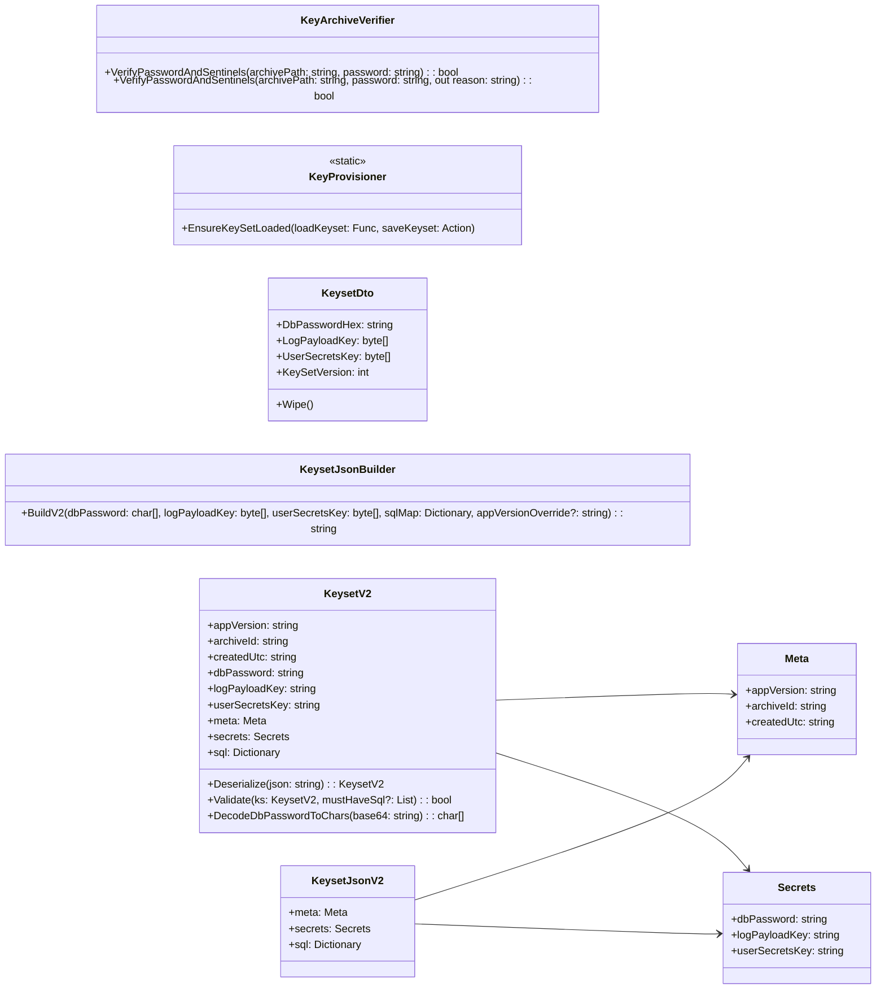

```mermaid
classDiagram
direction LR

class KeyArchiveVerifier {
  +VerifyPasswordAndSentinels(archivePath: string, password: string): bool
  +VerifyPasswordAndSentinels(archivePath: string, password: string, out reason: string): bool
}

class KeyProvisioner {
  <<static>>
  +EnsureKeySetLoaded(loadKeyset: Func<byte[]>, saveKeyset: Action<byte[]>)
}

class KeysetDto {
  +DbPasswordHex: string
  +LogPayloadKey: byte[]
  +UserSecretsKey: byte[]
  +KeySetVersion: int
  +Wipe()
}

class KeysetJsonBuilder {
  +BuildV2(dbPassword: char[], logPayloadKey: byte[], userSecretsKey: byte[], sqlMap: Dictionary, appVersionOverride?: string): string
}

class KeysetV2 {
  +Deserialize(json: string): KeysetV2
  +Validate(ks: KeysetV2, mustHaveSql?: List<string>): bool
  +DecodeDbPasswordToChars(base64: string): char[]
  +appVersion: string
  +archiveId: string
  +createdUtc: string
  +dbPassword: string
  +logPayloadKey: string
  +userSecretsKey: string
  +meta: Meta
  +secrets: Secrets
  +sql: Dictionary<string,string>
}

class Meta {
  +appVersion: string
  +archiveId: string
  +createdUtc: string
}

class Secrets {
  +dbPassword: string
  +logPayloadKey: string
  +userSecretsKey: string
}

class KeysetJsonV2 {
  +meta: Meta
  +secrets: Secrets
  +sql: Dictionary<string,string>
}

KeysetV2 --> Meta
KeysetV2 --> Secrets
KeysetJsonV2 --> Meta
KeysetJsonV2 --> Secrets

```
