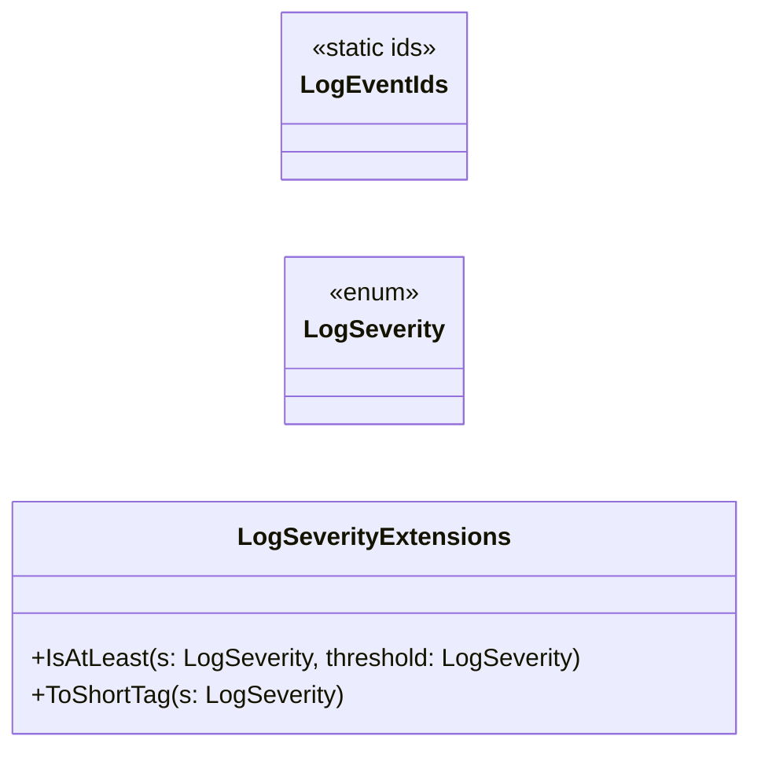

# Logging – Class Diagram

```mermaid
classDiagram
direction LR

class LogEventIds {
  <<static ids>>
}

class LogSeverity {
  <<enum>>
}

class LogSeverityExtensions {
  +IsAtLeast(s: LogSeverity, threshold: LogSeverity)
  +ToShortTag(s: LogSeverity)
}

```
