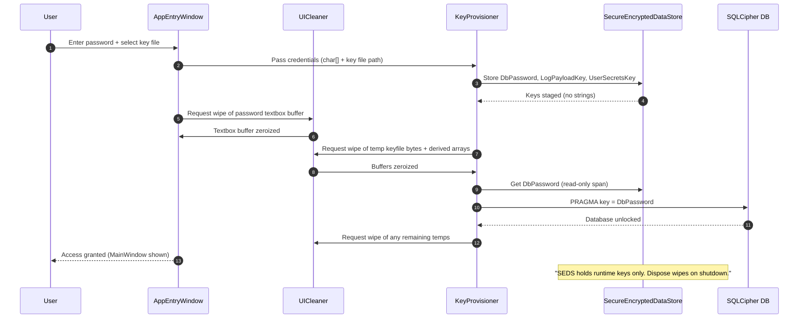

# Normal Login Sequence

## Legend
- **U** – User (person at keyboard)
- **W** – AppEntryWindow (the login/setup UI window)
- **C** – UICleaner (wipes textboxes, char[] buffers)
- **K** – KeyProvisioner (creates/loads keyset.json inside encrypted keyfile)
- **S** – SecureEncryptedDataStore (holds session keys in memory)
- **DB** – SQLCipher DB (encrypted SQLite database)
- **FS** – Filesystem (where keyfile lives)
- **E** – EarlyLoginFailures (DPAPI-protected early .elogp files)

## Diagram

