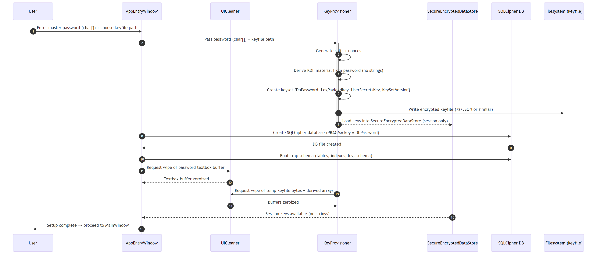
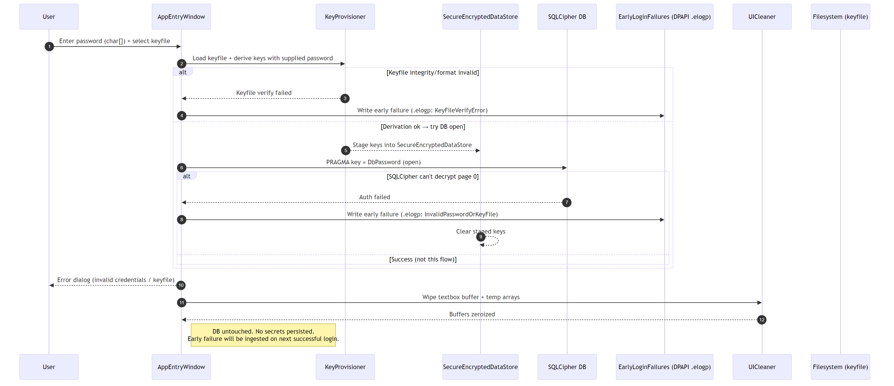
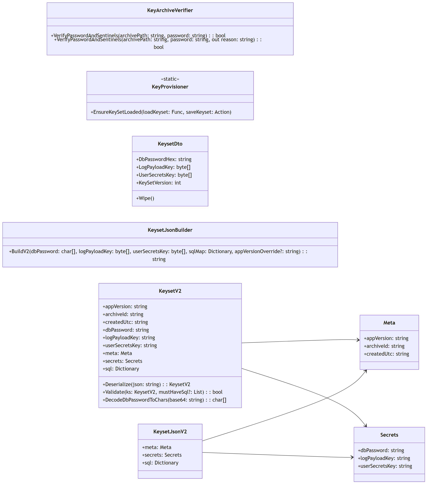
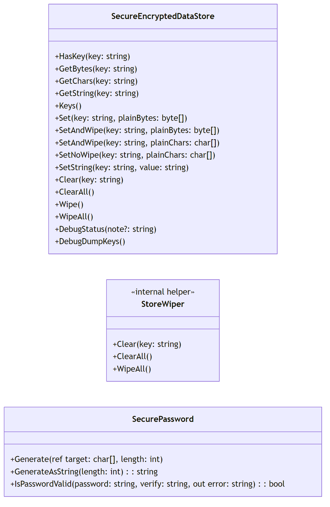
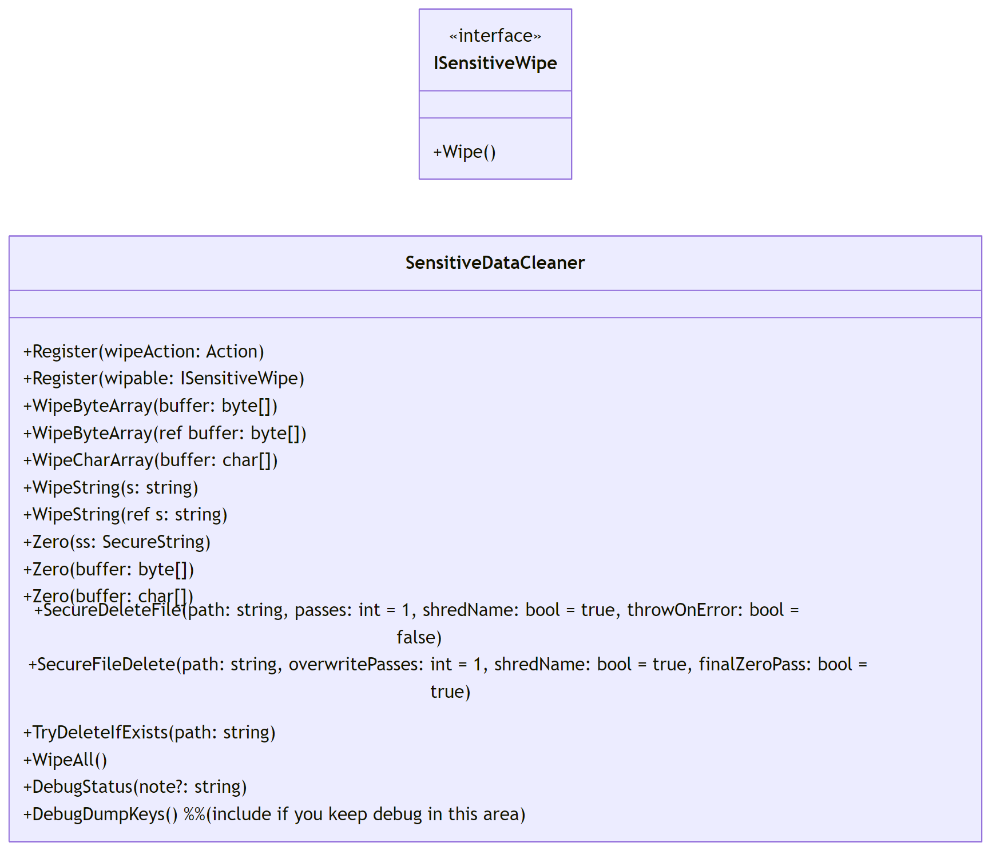
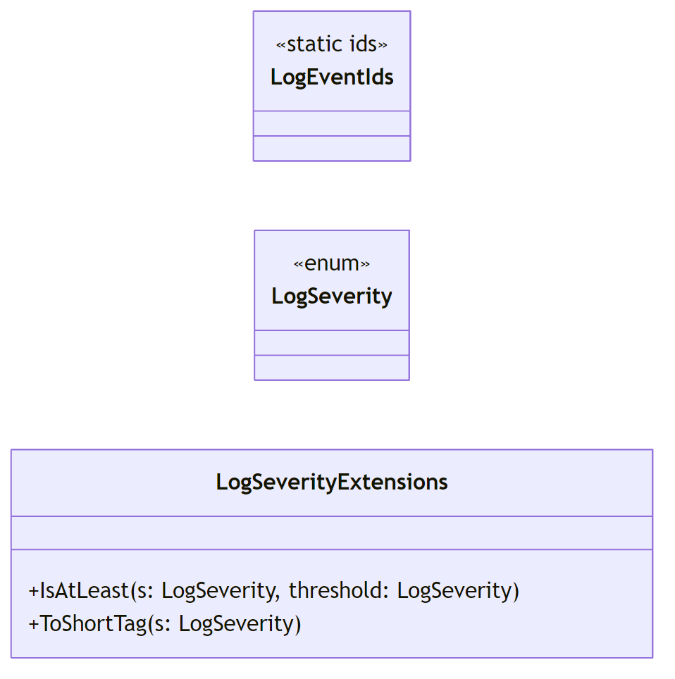
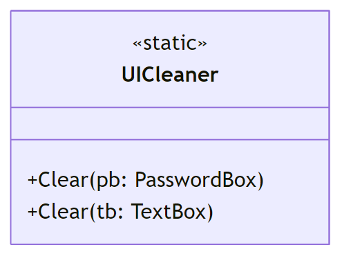

# MWPV Security Documentation

## Introduction
MWPV (My Windows Password Vault) enforces a layered security model:
- **UI Security**: Responsible only for wiping UI input fields (`PasswordBox`, `TextBox`).
- **Security.Utility DLL**: A reusable, application-agnostic library that manages encryption, key management, secure storage, wiping, and logging.

This document describes the design, flows, and class responsibilities that form the security backbone of MWPV.

**Defense-in-Depth.** An attacker generally needs **both** the key file *and* its password to read the vault. Once column-level encryption is enabled, certain fields are separately protected even if the DB layer is bypassed. **If the device is compromised while unlocked, or both the key file and password are exposed, the vault should be considered compromised.**

---

## Encryption Overview

### Database Encryption
- **SQLCipher** secures the SQLite database.
- Database key (`DbPassword`) is generated on first setup and stored only in the encrypted keyfile.

### Logging Encryption
- Logs are AES-256-GCM encrypted with a dedicated `LogPayloadKey`.
- Payloads include integrity-protecting metadata (nonce, version).

### Key File Protection
- The keyfile contains JSON (keys, metadata, SQL map) stored inside a **7-Zip encrypted archive**.
- A user-supplied password is run through a **KDF** (PBKDF2 or Argon2) to derive encryption keys.
- A `UserSecretsKey` is reserved for future sensitive user data.

### Early Login Failures
- Before DB is unlocked, failed login attempts are captured in `.elogp` files.
- These files are protected using **DPAPI**, making them machine-specific.
- On the next successful login:
  - `.elogp` files are ingested into the encrypted log tables.
  - The application displays a non-blocking notification that invalid login attempts occurred.
  - After ingestion, the original `.elogp` files are securely deleted.

---

## Password Policy

- Minimum length: **8 characters**.
- Must contain at least **2 of 3 categories**:
  - Uppercase letters  
  - Lowercase letters  
  - Special characters

A password strength meter is planned for the `PasswordEntryWindow` to give users live feedback while typing. 
This will be an early addition, but enforcement of the above rules occurs only at submission.

---

## Sensitive Data Handling

### In-Memory Protection
- Outside of active cryptographic operations, **sensitive values are encrypted in memory** under a per-session key; plaintext exists only transiently and is **zeroized immediately** after use.
- UI secrets (e.g., WPF `PasswordBox`/`TextBox`) are cleared via `UICleaner` immediately after use.

### Wiping Rules
- **All sensitive data** (passwords, keys, derived arrays, buffers) must be wiped immediately after use.
- Wiping is done via:
  - **Security.Utility DLL** for byte arrays, char arrays, `SecureString`, and buffers.
  - **UI Cleaner** for WPF controls (PasswordBox, TextBox).
- Rule of thumb: if data can unlock or reveal secrets, it **must be zeroized** when no longer needed.

---

## Sequence Flows

### Normal Login

### First-Time Setup

### Invalid Login

---

## Class Diagrams

### Crypto

### Storage

### Wiping

### Logging

### UI Cleaner

---

## Separation of Concerns

### UI Security
- `UICleaner` wipes only **UI input fields**.
- Responsible for clearing text/password boxes after login attempts.
- Keeps UI code clean, with minimal security logic.

### Security.Utility DLL
- Handles all **non-UI sensitive operations**:
  - Key management (KeyProvisioner, KeysetV2)
  - Secure storage (`SecureEncryptedDataStore`)
  - Wiping helpers (`SensitiveDataCleaner`, `MemoryWiper`)
  - Logging encryption and severity (`SecureLogService`, `LogSeverityExtensions`)
- DLL is **generic**: can be reused across any application needing secure handling of sensitive data.

---

## Appendix

- **Debug Helpers** (`DebugStatus`, `DebugDumpKeys`) are dev-only utilities and must not be used in production.
- Diagrams in this document are auto-generated using `export-mermaid.bat`.
- Future work:
  - Log Viewer UI with purge policies
  - Expansion of `UserSecretsKey` usage
  - Refinement of Argon2 parameters
  - Column-level encryption for sensitive user-entered data
    - Each protected column will be encrypted individually
    - Encryption: AES-256-GCM (provides confidentiality + integrity)
    - Key: a separate, randomly generated **UserSecretsKey** distinct from DbPassword/LogPayloadKey
    - Key will be provisioned on setup, stored only in the encrypted keyfile

---

## Reviewer Notes

- **Debug Helpers** (`DebugStatus`, `DebugDumpKeys`) are **dev-only utilities**. They must never be enabled in production.  
- The **Security.Utility DLL** should be considered a **standalone, reusable component**. It is not tied to MWPV-specific logic and can be used by any application.  
- All **sensitive memory** must be explicitly wiped (arrays, buffers, secure strings). The DLL handles this for non-UI objects; the UI is responsible only for clearing visual input controls.  
- Current **password policy enforcement** is at submission time. A strength meter is planned to provide early guidance but does not change the enforcement rules.  
- **Logs** are encrypted with AES-GCM to provide both confidentiality and integrity. **SQLCipher** secures the DB. **DPAPI** protects early login failure files. **7-Zip encryption** secures the keyfile archive.  
- Reviewers should confirm that all cryptographic primitives (AES-GCM, PBKDF2/Argon2, DPAPI, SQLCipher) are used in compliance with their recommended parameters and best practices.  
