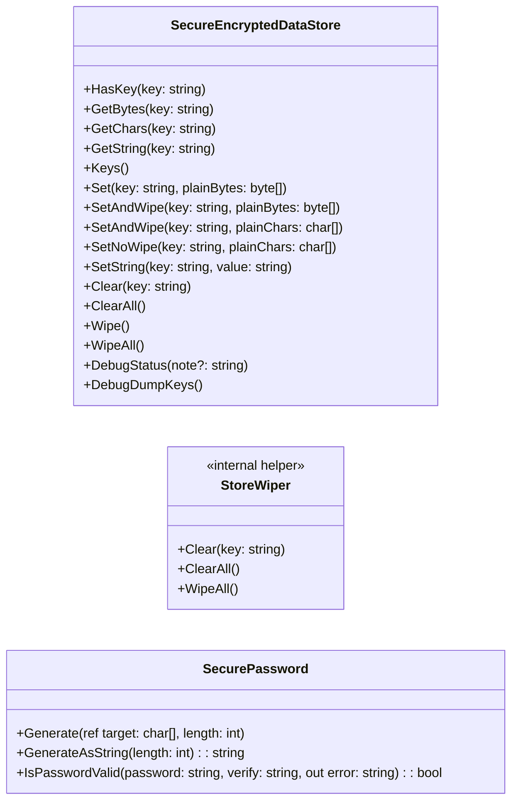

# Storage – Class Diagram

```mermaid
classDiagram
direction LR

class SecureEncryptedDataStore {
  +HasKey(key: string)
  +GetBytes(key: string)
  +GetChars(key: string)
  +GetString(key: string)
  +Keys()
  +Set(key: string, plainBytes: byte[])
  +SetAndWipe(key: string, plainBytes: byte[])
  +SetAndWipe(key: string, plainChars: char[])
  +SetNoWipe(key: string, plainChars: char[])
  +SetString(key: string, value: string)
  +Clear(key: string)
  +ClearAll()
  +Wipe()
  +WipeAll()
  +DebugStatus(note?: string)
  +DebugDumpKeys()
}

class StoreWiper {
  <<internal helper>>
  +Clear(key: string)
  +ClearAll()
  +WipeAll()
}

class SecurePassword {
  +Generate(ref target: char[], length: int)
  +GenerateAsString(length: int): string
  +IsPasswordValid(password: string, verify: string, out error: string): bool
}

```
