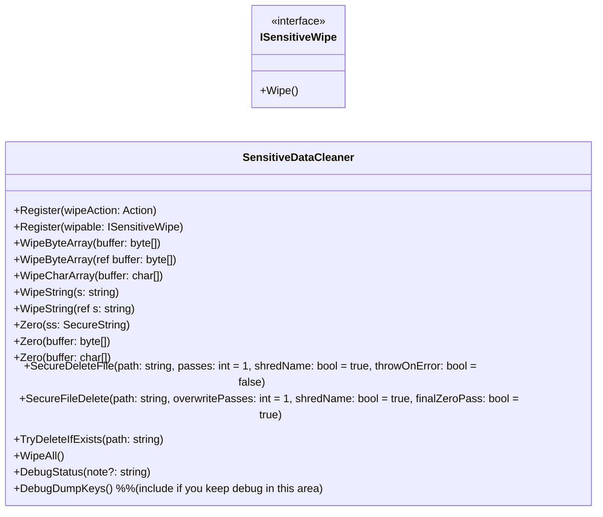

```mermaid
classDiagram
direction LR

class ISensitiveWipe {
  <<interface>>
  +Wipe()
}

class SensitiveDataCleaner {
  +Register(wipeAction: Action)
  +Register(wipable: ISensitiveWipe)

  %% byte[] / char[] / string
  +WipeByteArray(buffer: byte[])
  +WipeByteArray(ref buffer: byte[])
  +WipeCharArray(buffer: char[])
  +WipeString(s: string)
  +WipeString(ref s: string)

  %% SecureString / generic zeroing
  +Zero(ss: SecureString)
  +Zero(buffer: byte[])
  +Zero(buffer: char[])

  %% file ops
  +SecureDeleteFile(path: string, passes: int = 1, shredName: bool = true, throwOnError: bool = false)
  +SecureFileDelete(path: string, overwritePasses: int = 1, shredName: bool = true, finalZeroPass: bool = true)
  +TryDeleteIfExists(path: string)

  %% global cleanup & debug
  +WipeAll()
  +DebugStatus(note?: string)
  +DebugDumpKeys()  %% (include if you keep debug in this area)
}

```
