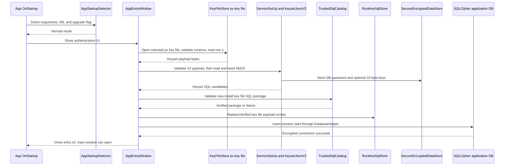
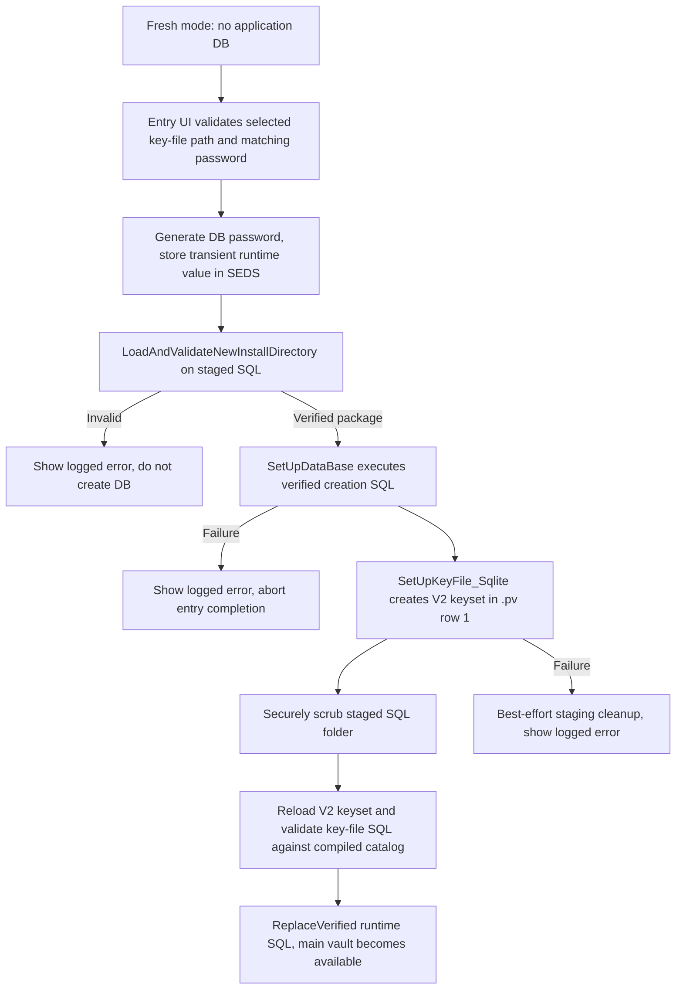
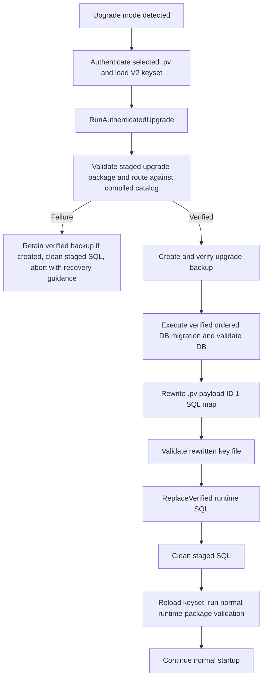

# MWPV Authentication, Key-File, and Runtime SQL Flow

## Purpose and scope

This is a source-grounded design and security record for the path from process startup to an authenticated, usable MWPV vault.  It covers the encrypted `.pv` key-file database, V2 keyset, SQL transport and verification, runtime SQL availability, and the authenticated portion of upgrade.  It does not replace the installer and rollback record; see [MWPV Installer, Upgrade, and Rollback Flow](MWPV_Installer_Upgrade_and_Rollback_Flow.md) for installer ownership and recovery.

`ServiceSetUp.EnsureKeySetFromArchive` and some nearby comments retain the historical word *archive*.  The current implementation routes that method to `EnsureKeySetLoadedFromKeyFile`, which reads an encrypted SQLite key-file database.  This document uses “key file” for the current behavior and calls out legacy terminology only where it affects interpretation.

## Data-root and startup modes

`App.OnStartup` (`MWPV/App.xaml.cs`) calls `AppStartupDetector.Detect` (`MWPV/Services/AppLifecycle/AppStartupDetector.cs`) before it shows `Utilities.Security.AppEntryWindow`.

`AppPaths.LocalAppDataRoot` (`MWPV/Utilities/Helpers/AppPaths.cs`) is the one data-root decision:

| Installation mode | Data root | Application database | Staged SQL folder |
|---|---|---|---|
| Executable on the Windows system drive | `%LOCALAPPDATA%` | `%LOCALAPPDATA%\MWPV\MWPV.db` | `%LOCALAPPDATA%\MWPV\sql` |
| Executable on another drive (portable) | `<exe-drive>\AppData\Local` | `<exe-drive>\AppData\Local\MWPV\MWPV.db` | `<exe-drive>\AppData\Local\MWPV\sql` |

`AppStartupDetector` selects these mutually exclusive modes:

| Mode | Detection | Authentication/SQL consequence |
|---|---|---|
| Fresh install | No application DB exists and no migration indicator wins | Entry UI provisions the DB and a new encrypted key file from a verified new-install staged package. |
| Normal | Application DB exists and no migration indicator wins | Entry UI validates the selected `.pv`, loads its keyset, validates its SQL payload against the compiled catalog, then populates runtime SQL. |
| Upgrade | `migration_flag`, `--upgrade`, `--migration`, `--migration-flag=...`, or a pending upgrade flag file | Entry UI authenticates first.  Only then `AppUpgradeCoordinator.RunAuthenticatedUpgrade` validates staged upgrade SQL, migrates, rewrites/revalidates the key-file SQL payload, replaces runtime SQL, and cleans staging. |

There is no separate automated vault-data recovery startup mode.  After an upgrade failure, the verified upgrade backup is retained and the user follows Help recovery instructions to restore the matching database and `.pv` manually.  Installer program-file rollback under `<data-root>\Rollback\code` is a separate responsibility.

## Authentication and key-file flow

### Entry UI and credential handling

`AppEntryWindow.btnSubmit_Click` is the authentication gate.  The user selects a key-file path and enters its password.  On normal or upgrade startup it:

1. requires a nonempty path and password;
2. converts the WPF `SecurePassword` to a transient `char[]` with `SecureStringToChars`;
3. calls `ValidateExistingSqliteKeyFile` before retaining the credentials;
4. only after validation, stores the path (non-sensitive) and password (sensitive) in `SecureEncryptedDataStore` (SEDS);
5. clears the UI controls, loads the V2 keyset, and validates the SQL payload before opening the main vault.

`ValidateExistingSqliteKeyFile` splits the selected path, calls `KeyFileStore.CanOpenAndValidateSchema`, reads payload ID `1` through `KeyFileStore.ReadPayloadBytes`, rejects an empty row, and calls `KeyProvisioner.ValidateKeysetJsonResult` on the payload.  The raw payload buffer is cleared in its `finally` block.  The method treats a wrong password, inaccessible file, invalid schema, missing row, malformed payload, and invalid V2 content as failed validation rather than trusted credentials.

After storing credentials, `KeyProvisioner.ValidateKeysetJsonResult(service.LoadKeysetJsonBytes)` repeats a read-only V2 validation.  `ServiceSetUp.EnsureKeySetFromArchive` then reads the same payload and seeds runtime state.  The apparent “archive” method name is a compatibility shim; it calls `EnsureKeySetLoadedFromKeyFile`.

Failure before the entry window closes keeps the main window unavailable.  Input failures are surfaced in the entry UI.  Key-file validation is recorded via `EarlyLoginFailures`; the corrupt-keyset path invokes the fatal popup.  The code clears transient character and byte buffers where it owns them, but a failed UI path does not itself prove a process-wide SEDS wipe; final process shutdown invokes `SensitiveDataCleaner.WipeAll` from `App.OnExit`.

### Key-file database boundary

The key file is a user-selected encrypted SQLite database.  First-run UI defaults its save name to `Kb.pv`; it is **not** required to live beneath the MWPV data root.  MWPV stores its selected location in SEDS for the current session.  The database is opened through `Microsoft.Data.Sqlite` with `SqliteConnectionStringBuilder.Password`, so the encryption boundary is the SQLite/SQLCipher-capable provider and its password, not the filename extension.

`KeyFileLogic.KeyFileStore` owns its storage contract:

| Object | Current schema/meaning |
|---|---|
| Table | `KeyFilePayload` |
| Key column | `KeyFilePayloadId INTEGER PRIMARY KEY` |
| Value column | `Value BLOB NOT NULL` |
| Required current row | ID `1`, UTF-8 bytes of the V2 keyset JSON |
| Not stored as separate rows | Database password, log payload key, user-secrets key, or individual SQL files |

The file therefore contains one encrypted BLOB carrying the V2 keyset; it is not a plaintext keyset file, an SQL staging directory, or a copy of the application database.  `CanOpenAndValidateSchema` checks that the file can be opened and that the table and required column characteristics are present.  `ReadPayloadBytes` then requires the requested row.  `BuildKeyFilePath` rejects invalid names and path traversal, and the store requires an existing directory.

This is an authentication boundary in the practical sense: successful database open plus schema and keyset validation is required before MWPV accepts the chosen credentials.  It is not a separate account-authentication system, and `KeyProvisioner` does not add a signature over the JSON.  The protection of the persisted payload depends on the encrypted SQLite key-file database and its password.

### V2 keyset contents and runtime transfer

`Security.Utility.Crypto.KeysetJsonBuilder.BuildV2` creates `KeysetV2`, and `KeysetJsonV2.Deserialize`/`Validate` reads it.  Logical fields are:

| Section | Content | Runtime destination |
|---|---|---|
| `keySetVersion` | Required value `2` | Validated; unsupported values abort keyset acceptance. |
| `createdUtc` | Creation timestamp | Metadata only. |
| `meta.archiveId`, `meta.appVersion` | Compatibility/trace metadata | Metadata only.  `archiveId` is retained legacy naming. |
| `secrets.dbPassword` | Base64 of UTF-8 database-password bytes | Decoded to `char[]`, then stored as `DB_Password.txt` in SEDS. |
| `secrets.logPayloadKey` | Base64 optional 32-byte log payload key | Decoded and stored as `LogPayloadKey` in SEDS. |
| `secrets.userSecretsKey` | Base64 optional 32-byte user-secrets key | Decoded and stored as `UserSecretsKey` in SEDS. |
| `sql` | Filename-to-SQL-text map | Held temporarily in `ServiceSetUp._loadedSqlPayload` and represented in SEDS; revalidated before entering `RuntimeSqlStore`. |

`KeyProvisioner.ValidateKeysetJsonResult` sequentially parses the JSON, requires V2, `dbPassword`, and a nonempty `sql` section, verifies Base64 syntax, and checks supplied optional log/user keys are exactly 32 bytes.  It wipes the raw JSON byte buffer and transient decoded buffers it owns.  `KeysetJsonV2.Validate` additionally supports a required SQL-name list; upgrade validation uses this after rewriting the payload.

`ServiceSetUp.SeedSedsFromKeysetJson` deserializes the payload, decodes the database password, copies SQL text into its loaded payload, and places the byte keys into SEDS.  The JSON string and decoding buffers are cleaned by the loader.  The keyset is decrypted in the sense that SQLite returns plaintext payload bytes after opening the encrypted `.pv`; the JSON itself has no independent application-level encryption or signature layer.

## Compiled SQL catalog and the three SQL representations

The system deliberately separates SQL transport, persisted key-file payload, and service-time runtime SQL:

| Representation | Location/source | Trust state | Owner/lifetime |
|---|---|---|---|
| Staged SQL | `<data-root>\MWPV\sql`, delivered for new install/upgrade | Untrusted transport input until catalog validation | Inno before launch; MWPV after launch during upgrade.  `SqlStagingCleanupService` removes it after successful first-run key-file creation and upgrade terminal outcomes. |
| Keyset SQL | `sql` map in encrypted `.pv` payload ID 1 | Persisted application material, but validated against the compiled catalog at login | Key-file store persists it; `ServiceSetUp` loads it. |
| Runtime SQL | `Utilities.Sql.RuntimeSqlStore` immutable snapshot | Verified text only | Available after entry authentication succeeds; replaced atomically after upgrade. |

`MWPV.SqlCatalog.TrustedSqlCatalog` is the compiled authority.  Its catalog entries specify filename, SHA-256, stable order, role, new-install inclusion, key-file-payload inclusion, and (where applicable) upgrade version edges.  `ValidateNewInstallFiles` and `ValidateUpgradeFiles` validate in-memory candidates; `LoadAndValidateNewInstallDirectory` and `LoadAndValidateUpgradeDirectory` provide directory adapters for staged transport input.

The validation chain rejects missing required files, unknown candidates passed directly to the validator, duplicate names (case-insensitive), empty content, non-strict UTF-8, and SHA-256 mismatches.  Upgrade validation also resolves the required route from current to target version and requires the route scripts plus required key-file payload scripts.  New-install validation requires the database-creation script and the catalog's configured key-file payload scripts.

The directory adapter enumerates the required top-level filenames; extra `.sql` files in a staging directory are ignored rather than executed.  Conversely, an extra candidate handed directly to `ValidateNewInstallFiles` or `ValidateUpgradeFiles` is rejected as unknown.  In either case, only the exact required and hash-verified catalog entries form a package.

At normal login, `AppEntryWindow` obtains candidates from `ServiceSetUp.GetVerifiedPayloadCandidates`—the SQL text previously read from the keyset—and calls `TrustedSqlCatalog.ValidateNewInstallFiles`.  It then calls `RuntimeSqlStore.ReplaceVerified(runtimePackage.Value.KeyFilePayloadScripts)`.  Thus services do not read raw staged SQL, and they do not retrieve arbitrary SQL directly from the keyset.  They call `RuntimeSqlStore.GetSql(name)`, which fails closed for a missing or empty entry.

## Database password and SQLCipher access

The following is the current password path:

1. First run creates a 32-character database password via `SecurePassword.Generate`; normal/upgrade reads it from `secrets.dbPassword` in the unlocked keyset.
2. `ServiceSetUp` places the password under `DatabaseHelper.DbPasswordKey` (`DB_Password.txt`) in SEDS.  SEDS encrypts values in process memory with a session AES-256 key, AES-GCM nonce/tag/ciphertext layout, and logical key name as associated data.
3. `DatabaseHelper.GetAppOpenConnection` calls `ReadDatabasePassword`, which returns a `char[]`; `WithDatabasePasswordString` makes a scoped `string` only to configure the connection, and wipes its local char buffer and attempts to wipe the string reference afterwards.
4. `SqliteConnectionStringBuilder` supplies `DataSource`, `ReadWriteCreate`, and `Password` to `SqliteConnection`; opening then enables `foreign_keys`, `secure_delete`, and WAL journal mode.
5. A database-opening failure displays the standardized “Encrypted Database Locked” message, calls `AppExit.Shutdown` with `StartupDatabaseOpenFailed`, and throws.  The main vault is not made available by this failure path.

Connection consumers use `DatabaseHelper.GetAppOpenConnection`/`OpenConnection`; individual services dispose their connections with `using`/`await using`.  First-run creation executes the verified creation SQL through this same helper.  Upgrade has its own version-reader/executor connection path (`DbUpgradeVersionReader`, `DbUpgradeExecutor`) after authenticated credential collection.

At process exit `App.OnExit` calls `SensitiveDataCleaner.WipeAll`.  That registered cleanup reaches `SecureEncryptedDataStore.WipeAll`, which clears encrypted value buffers and zeroes its session AES key.  This is a strong ownership boundary for buffers SEDS controls, not a guarantee to erase all .NET strings, SQLite provider internals, connection strings, OS pages, or native SQLCipher buffers.

## Normal authenticated login

The actual code writes `SESSION_START` immediately after runtime SQL population.  The exact timing of every subsequent service database open is demand-driven; the `DatabaseHelper` gate remains the common password/open path.

## Fresh-install provisioning

On fresh install, `AppEntryWindow` uses a save dialog (default `Kb.pv`) and password confirmation.  It stores the selected path and key-file password in SEDS, generates/stores the DB password, validates the complete staged new-install package with `TrustedSqlCatalog.LoadAndValidateNewInstallDirectory`, then calls `ServiceSetUp.SetUpDataBase` and `SetUpKeyFile`.

`SetUpDataBase` executes only the verified database-creation SQL.  `SetUpKeyFile_Sqlite` creates random 32-byte log and user-secret keys, builds the V2 keyset using the verified package's key-file payload SQL, and writes its UTF-8 JSON to payload ID 1.  It then requests `SqlStagingCleanupService.SecurelyScrubDefaultStagingFolder`.  The same cleanup is attempted on key-file creation failure.  Once provisioning returns to the common path, the app reloads the key file, validates the SQL payload against the compiled catalog, and populates `RuntimeSqlStore`.

The code contains a marked future note that fresh key-file creation does not yet perform a post-save reopen/read/validate before returning.  The later common load does validate it before completing authentication, but this is not an atomic creation-and-verification transaction.

## Upgrade intersection: authenticated SQL and key-file path

The installer places staged SQL and launches MWPV asynchronously; after launch, MWPV owns staged SQL.  Details of installer program rollback, backups, and manual recovery are intentionally covered in [MWPV Installer, Upgrade, and Rollback Flow](MWPV_Installer_Upgrade_and_Rollback_Flow.md).

Within MWPV, `AppEntryWindow` completes the normal `.pv` password/schema/keyset validation first.  If the startup context says `Upgrade`, it calls `AppUpgradeCoordinator.RunAuthenticatedUpgrade` before normal runtime SQL initialization.  The coordinator reads the current DB version, validates staged SQL with `TrustedSqlCatalog.LoadAndValidateUpgradeDirectory`, creates a verified upgrade backup, executes the ordered verified migration scripts, validates the upgraded DB, and calls `KeyFileUpgradeService.RewriteSqlPayload`.

The rewrite reads key-file payload ID 1, deserializes `KeysetV2`, replaces only its `sql` map with the verified package's normal/key-file-payload SQL, and saves row 1.  `KeyFileUpgradeService.ValidateKeyFile` then checks the SQLite schema, payload, V2 structure, and required SQL names.  The coordinator replaces `RuntimeSqlStore` from the verified package, cleans staged SQL, and returns to the entry window; the entry window reloads the keyset and performs its usual compiled-catalog validation before completing normal startup.

For every terminal upgrade result after MWPV has launched, `AppUpgradeCoordinator` calls `CleanUpStagedSql`; `App.OnExit` also guards against upgrade staging surviving early exit.  A cleanup failure is logged without replacing the original upgrade result.  There is no automatic restore of DB or `.pv` after upgrade failure: the retained verified backup is for explicit manual restoration of the matched pair.

## Failure matrix

“Wiped” below means buffers are cleared where the named code owns them; it is not a claim to wipe framework/native copies.

| Condition | Detection point | User-visible behavior | Logging | Cleanup and result |
|---|---|---|---|---|
| Key file missing | `CanOpenAndValidateSchema` / path validation | Entry error: invalid password or key file | `EarlyLoginFailures` | Temporary password/payload buffers cleared; startup remains at entry. |
| Key file inaccessible | `KeyFileStore` open/path validation | Same entry error | `EarlyLoginFailures` | Transients cleared; abort authentication. |
| Login rejected/wrong key-file password | SQLCipher key-file open or validation failure | Same entry error | `EarlyLoginFailures` | Password `char[]` cleared; no main vault. |
| Key-file DB open failure | `KeyFileStore.OpenConnection` | Same entry error | `EarlyLoginFailures` | Scoped password string is wiped by store attempt; no continuation. |
| Keyset row missing | `ReadPayloadBytes(…, 1)` | Invalid/corrupt key-file behavior | `EarlyLoginFailures`; fatal path after stored-credential validation | Payload buffers cleared; startup aborts. |
| Keyset payload/JSON malformed | `KeyProvisioner.ValidateKeysetJsonResult` or `KeysetJsonV2.Deserialize` | Corrupt-key-file fatal popup or entry failure | `EarlyLoginFailures` / fatal details | JSON bytes and owned decode buffers wiped; no main window. |
| Unsupported keyset version | V2 validation | Corrupt-key-file fatal behavior | `EarlyLoginFailures` | Owned temporary buffers wiped; abort. |
| Required DB password or SQL map absent | `KeyProvisioner` / `KeysetJsonV2.Validate` | Corrupt-key-file fatal behavior | `EarlyLoginFailures` | Owned temporary buffers wiped; abort. |
| Optional log/user key invalid length | `KeyProvisioner.ValidateOptionalKeysetKey` | Corrupt-key-file fatal behavior | `EarlyLoginFailures` | Decoded key buffer wiped; abort. |
| Missing staged SQL | Catalog directory loader | Fresh: required-package error; upgrade: upgrade failure/recovery guidance | Entry failure log or upgrade logger | Fresh does not start creation; upgrade cleans staging and aborts. |
| Altered SQL hash / invalid UTF-8 / empty required SQL | `TrustedSqlCatalog` | Same as missing package | Catalog failure detail is logged | No unverified SQL executes; relevant staging cleanup occurs. |
| Duplicate SQL filename | Catalog in-memory validation / runtime replace | Entry package error or upgrade failure | Entry/upgrade logging | No runtime publication; upgrade cleanup runs. |
| Extra staged file | Directory loader only considers required top-level names | No user message solely for extra file | None required | Extra file is not executed; staging cleanup later removes folder. |
| Runtime SQL population failure | `RuntimeSqlStore.ReplaceVerified` | Entry failure/exception prevents completed login; upgrade returns failure | Entry or upgrade logger | Existing snapshot is not replaced by a failed build; upgrade cleans staging. |
| DB password unavailable | SEDS retrieval / `WithDatabasePasswordString` | Encrypted-database locked dialog and shutdown where open is attempted | Standard error/exit path | Returned password buffers are wiped when obtained; startup cannot proceed. |
| SQLCipher application DB open failure | `DatabaseHelper.GetAppOpenConnection` | “Encrypted Database Locked”; app shutdown | Standard error/exit path | Scoped char/string cleanup runs; connection absent. |
| Database version mismatch / invalid migration result | `DbUpgradeVersionReader`, `DbUpgradeExecutor`, coordinator validation | Upgrade failure popup directs Help recovery | Upgrade logger | Staged SQL cleaned; verified upgrade backup retained; no automatic DB/`.pv` restore. |
| Unexpected exception | Entry, setup, key-file, or coordinator catch path | Logged entry/fatal error or upgrade recovery guidance | `ErrorHandler`, `EarlyLoginFailures`, and/or upgrade logger | Finally blocks/best effort cleanup run; startup aborts on terminal failure. |

## Sensitive-data lifecycle

| Data | Source → destination | Stored protection | In-memory protection/lifetime | Cleanup owner and known limitation |
|---|---|---|---|---|
| Key-file login password | WPF `SecurePassword` → `char[]` → SEDS → key-file connection | SEDS AES-GCM during session; key-file uses it to unlock SQLCipher | Transient `char[]`; provider setup requires a scoped .NET `string` | UI/store clear owned buffers.  Managed/provider copies cannot be proven wiped. |
| Database password | New generator or V2 `dbPassword` → `DB_Password.txt` SEDS → SQLite connection | Base64 inside encrypted `.pv`; AES-GCM in SEDS | Retrieved `char[]`, scoped string for connection open | `DatabaseHelper` and SEDS wipe owned buffers; provider/native copies remain uncertain. |
| Log payload key | V2 base64 → SEDS `LogPayloadKey` | Encrypted `.pv` then SEDS | Decoded byte buffer used to seed session | Loader clears its buffer; SEDS global wipe at shutdown. |
| User-secrets key | V2 base64 → SEDS `UserSecretsKey` | Encrypted `.pv` then SEDS | Decoded byte buffer used to seed session | Loader clears its buffer; SEDS global wipe at shutdown. |
| Decrypted keyset JSON | Payload row 1 → byte[]/string during validation/load | Encrypted at rest only in `.pv` | Plaintext byte[] and string exist transiently for parse/load | Load/validation clears owned byte arrays and attempts string wiping; GC/runtime copies cannot be guaranteed. |
| Verified SQL text | Stage or keyset → catalog `VerifiedSqlFile` → runtime snapshot | `.pv` encrypted at rest; staged transport has no implied encryption | `string` values in verified packages/runtime snapshot for process lifetime | Staging scrubber owns files; SQL strings are not wipeable in the same way as buffers. |
| Staged SQL files | Installer delivery → MWPV SQL directory | No trust or confidentiality guarantee is implied by staging | Disk files until cleanup | Installer before app launch; MWPV after launch.  Cleanup is best effort and logged on failure. |
| SQLCipher connection state | `DatabaseHelper` → `SqliteConnection` | Encrypted database at rest | Provider/native process state while connection is open | Caller disposes connection. OS/framework/native buffering is outside application wipe control. |

For broader mechanics, see [MWPV Sensitive Data in Memory Flow](MWPV_Sensitive_Data_In_Memory_Flow.md) and [Security Utility Data Flow](Security_Utility_Data_Flow.md).  The ownership model is summarized in [MWPV Component Responsibilities and Trust Boundaries](MWPV_Component_Responsibilities_and_Trust_Boundaries.md).

## Responsibilities and trust boundaries

| Component | Responsibility | Explicit non-responsibility |
|---|---|---|
| `App` / `AppStartupDetector` | Detect mode and show entry UI | Does not authenticate the key file or trust SQL. |
| `AppEntryWindow` | Collect credentials, gate main-window availability, coordinate first-run/normal/upgrade entry | Does not define key-file schema or catalog hashes. |
| `KeyFileStore` | Encrypted SQLite key-file open, path/schema validation, row read/write | Does not decide which SQL is trusted. |
| `KeysetJsonV2` / `KeyProvisioner` | V2 structural, Base64, and key-length validation | Does not sign JSON or restore a vault. |
| `TrustedSqlCatalog` | Compiled SQL allowlist, hash/UTF-8/content/route verification, verified package construction | Does not execute migration SQL or persist keysets. |
| `SqlStagingCleanupService` | Best-effort secure scrub/delete of default staging directory | Does not validate staged SQL. |
| `RuntimeSqlStore` | Atomically publish and retrieve verified SQL snapshot | Does not read files or validate hashes. |
| `SecureEncryptedDataStore` | Process-session encrypted storage and global wipe of its managed ciphertext/key buffers | Cannot guarantee erasure of framework/native copies. |
| `DatabaseHelper` | Resolve DB path, retrieve password, open/configure encrypted application DB | Does not validate the selected key file. |
| `AppUpgradeCoordinator` / `KeyFileUpgradeService` | Authenticated migration, key-file SQL rewrite/revalidation, runtime replacement, staged cleanup | Does not automatically restore DB/`.pv`; installer code rollback is separate. |
| `App.OnExit` | Invoke global sensitive-data wipe and upgrade staging guard | Does not constitute a process-exit handshake with the installer. |

## Design rationale

An encrypted SQLite `.pv` keeps the V2 keyset as one durable, structured payload protected by the user password, replacing the older 7z key-file approach while retaining selected compatibility method names.  The compiled catalog means neither a staged file nor a persisted keyset SQL string is automatically executable: its name, exact bytes, decode validity, and required role must match code compiled into MWPV.

Verified packages separate the catalog decision from provisioning and upgrade execution.  The runtime SQL store gives services a single read-only, atomic snapshot rather than direct file or key-file access, and it can be replaced after a verified upgrade.  SEDS separates persisted secrets from runtime access: the database password is not kept as an ordinary application field, although no managed process can promise complete elimination of all temporary copies.

This division also makes ownership clear: installer/MWPV staging is transport material, key-file SQL is persistent encrypted material, and runtime SQL is only the validated service-time snapshot.

## Proven limitations and operational notes

- .NET immutable strings, SQLite/SQLCipher provider state, OS paging, and framework connection-string buffering cannot be conclusively zeroized by this application.
- SQL text is not treated as a secret, but it is security-sensitive: modification is prevented from becoming executable only by catalog verification.
- A directory-based catalog load ignores extra staged files rather than rejecting the entire directory; it never executes those extras.
- First-run key-file writing has a source-marked future improvement: it does not immediately reopen/read/validate the just-saved payload before returning.  The common subsequent load still validates before entry completion.
- Key-file validation is structural/format validation after encrypted SQLite open; there is no separate application-level signature over the V2 JSON.
- Upgrade failure keeps its verified backup for manual paired database/`.pv` recovery; there is intentionally no automatic restore and no installer/application exit-code handshake.
- The installer/application remain unsigned as an intentional current local-distribution limitation; Windows publisher warnings may still be shown.  Public source review does not remove those warnings.
- Failure logs can contain diagnostic details.  User-facing upgrade failure guidance does not expose internal paths or exception details.

## Implementation reference index and validation

The document was validated against the following current implementation references:

| Area | Source references |
|---|---|
| Startup/mode | `MWPV/App.xaml.cs` — `OnStartup`, `OnExit`; `MWPV/Services/AppLifecycle/AppStartupDetector.cs` — `Detect` |
| Entry authentication | `MWPV/Utilities/Security/AppEntryWindow.xaml.cs` — `btnSubmit_Click`, `ValidateExistingSqliteKeyFile` |
| Key-file and keyset | `MWPV/KeyFileLogic/KeyFileStore.cs` — `CanOpenAndValidateSchema`, `ReadPayloadBytes`, `SavePayload`; `Security.Utility/Crypto/KeysetV2.cs` — `KeysetJsonV2`; `Security.Utility/Crypto/KeyProvisioner.cs` — `ValidateKeysetJsonResult`; `MWPV/Utilities/Security/ServiceSetUp.cs` — `SetUpDataBase`, `SetUpKeyFile_Sqlite`, `EnsureKeySetLoadedFromKeyFile`, `SeedSedsFromKeysetJson`, `GetVerifiedPayloadCandidates` |
| SQL verification/runtime | `MWPV/MWPV.SqlCatalog/TrustedSqlCatalog.cs` — validation/load methods; `MWPV/MWPV.SqlCatalog/SqlCatalogModels.cs`; `MWPV/Utilities/Sql/RuntimeSqlStore.cs` — `ReplaceVerified`, `GetSql` |
| DB/security runtime | `MWPV/Utilities/Helpers/AppPaths.cs` — `LocalAppDataRoot`; `MWPV/Utilities/Helpers/DatabaseHelper.cs` — `GetAppOpenConnection`, `WithDatabasePasswordString`; `Security.Utility/Storage/SecureEncryptedDataStore.cs` — set/get/wipe methods |
| Upgrade/staging | `MWPV/Services/Upgrade/AppUpgradeCoordinator.cs` — `RunAuthenticatedUpgrade`, `CleanUpStagedSql`; `MWPV/Services/Upgrade/KeyFileUpgradeService.cs`; `MWPV/Services/Upgrade/DbUpgradeExecutor.cs`; `MWPV/Utilities/Security/SqlStagingCleanupService.cs` |

The Mermaid diagrams use quoted node/participant labels and GitHub-supported `flowchart TD` and `sequenceDiagram` syntax.  The normal, fresh-install, and upgrade diagrams match the current call paths above.  Companion documents reviewed were the installer/rollback flow, sensitive-memory flow, Security Utility flow, and component-responsibilities document.  `Security_Utility_Data_Flow.md` still says that V2 Base64 database-password representation relies on “archive encryption”; that wording is legacy terminology and should be updated separately to say the encrypted SQLite key-file database.  The source-marked post-save fresh-key-file verification gap and the inability to prove framework/native buffer wiping are the remaining runtime/testing uncertainties.
