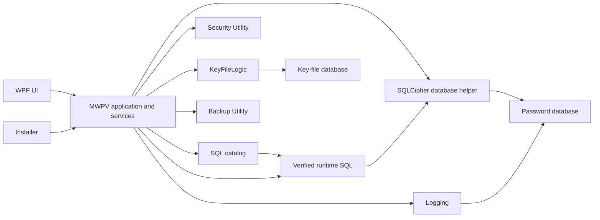

# MWPV Component Responsibilities and Trust Boundaries

## 1. Purpose

This document defines the ownership, dependency, and trust boundaries of the current MWPV implementation. It is for maintainers, security reviewers, technical buyers, and future developers. [MWPV_High_Level_Flow.md](MWPV_High_Level_Flow.md) explains how the system moves through startup, runtime, upgrade, and shutdown; this document explains what each major component owns and where its authority ends.

## 2. Architectural Principles

- The WPF UI, application orchestration, persistence, security utilities, backup utilities, logging, SQL validation, and key-file access are separated into identifiable layers or projects.
- Sensitive values are held as `char[]` or `byte[]` where practical, passed through protected in-process storage, and wiped on cleanup paths; immutable strings still exist at constrained integration points.
- The password database and key-file database use SQLCipher connections. Early login failures use Windows DPAPI before the password database is available.
- Rich pre-authentication diagnostics have a deliberately narrower persistence boundary: DPAPI-protected early-login files may hold them temporarily, while the normal log database retains only limited operational metadata and a derived hash on ingestion.
- Runtime services retrieve SQL from `RuntimeSqlStore`; the catalog validates required staged or key-file payload SQL using SHA-256 before it is published to that store.
- Services own their database commands and, for multi-step writes, explicit transactions. Logging calls commonly follow committed work; session and early-ingest logging are best effort.
- Utility boundaries return result objects, statuses, or explicit exit codes rather than requiring callers to infer success from UI state.
- Shutdown and error paths make best-effort attempts to clear MWPV-owned clipboard data and wipe registered sensitive state.
- Component boundaries are intentional: simplifying class counts must not move UI policy, business orchestration, SQL trust, cryptography, key-file access, or backup policy into an unrelated component.

## 3. Component Summary

| Component | Primary Responsibility | Owns | May Call | Must Not Own |
|---|---|---|---|---|
| MWPV WPF application | Process lifecycle and authenticated application flow | Startup mode, windows, exit state | UI, services, utilities | Reusable crypto or generic backup mechanics |
| Application UI and panels | User interaction and presentation | Controls, prompts, display state | Application services | SQL text, connection creation, cryptographic policy |
| Application orchestration services | Use-case coordination | Category/item/settings/upgrade/exit workflows | Database helper, runtime SQL, utilities | UI rendering or installer deployment |
| Database access and repository layer | Execute application data operations | Commands, parameters, service transactions | SQLCipher connections, runtime SQL | SQL file trust decisions |
| SQLCipher connection handling | Open configured encrypted DB connections | Connection construction and PRAGMAs | Protected runtime database password | UI decisions or business workflow |
| MWPV.SqlCatalog | SQL allowlist and validation rules | Names, hashes, roles, upgrade route planning | File inputs | File staging, UI, database execution |
| Trusted SQL runtime storage | In-process verified SQL snapshot | Published SQL text snapshot | Verified catalog output | Disk loading or validation bypass |
| Security.Utility | Shared security primitives | Crypto, protected store, wiping, security result types | .NET crypto/DPAPI APIs | WPF policy or vault business rules |
| KeyFileLogic | SQLCipher key-file database access | Key-file schema and payload rows | SQLCipher | Application login UI or SQL catalog policy |
| Backup.Utility | Generic backup-set operations | Staging, manifests, hashes, verification, retention, restore | Filesystem | Vault business rules or UI prompts |
| Logging subsystem | Normal audit/session log persistence and reads | Persisted operational metadata, templates, and `KeySetVersion` | Runtime SQL, SQLCipher | Raw passwords, keys, or rich diagnostic payloads |
| Early-login logging | Pre-authentication failure capture and data-minimized ingest | DPAPI `.elogp` files and quarantine | DPAPI, normal log service after login | Normal database access before authentication or detailed-payload persistence after ingestion |
| Upgrade and migration subsystem | Authenticated upgrade execution and rollback | Upgrade validation, backup orchestration, execution results | Catalog, backup, key-file, DB upgrade services | Installer file deployment |
| Installer integration | Deploy files, stage SQL, update launch marker, code rollback copy | Installation/update actions | MWPV executable | Application database mutation |
| Session state and shutdown cleanup | Session flags and final cleanup | Exit cleanup coordination | Clipboard service, wiping utility | Persistent backup implementation |
| Sensitive clipboard service | MWPV-owned clipboard lifecycle | Ownership marker, timer, clear attempts | Windows clipboard, settings, log service | General system clipboard policy |
| AppSettings subsystem | Read/validate/persist application settings | Setting validation and updates | Runtime SQL, SQLCipher | Clipboard implementation or UI layout |

## 4. Detailed Component Responsibilities

### MWPV WPF Application

**Purpose** — Own the executable lifecycle, startup-mode detection, entry dialog, main window, and application exit behavior.

**Owns** — Single-instance handling, modal authentication entry, WPF window sequencing, early-log ingestion after login, and global shutdown hooks.

**May Call** — Application services, `Security.Utility`, `KeyFileLogic` through setup/login code, `MWPV.SqlCatalog`, and `Backup.Utility` through coordinators.

**Must Not Own** — Generic cryptographic algorithms, backup file protocol, or raw SQL catalog definitions.

**Sensitive Data Exposure** — Receives password input transiently through the entry UI; coordinates protected runtime loading and final wiping.

**Failure and Result Handling** — Uses `AppExitCode`, `AppExit`, dialogs, and best-effort early logging. Startup authentication failures do not enter normal runtime.

**Relevant Implementation Areas** — `App.xaml.cs`, `MainWindow.xaml.cs`, `Utilities/Security/AppEntryWindow`, `Services/AppLifecycle`.

### Application UI and Panels

**Purpose** — Present vault functions and collect user actions.

**Owns** — XAML controls, panel state, prompts, and display-specific scrubbing.

**May Call** — Application services and status-message mechanisms.

**Must Not Own** — Direct database access, trusted SQL loading, key-file access, or backup implementation.

**Sensitive Data Exposure** — Password boxes and displayed/copyable vault values are UI-facing; UI cleanup removes control values but is not the sole runtime wipe boundary.

**Failure and Result Handling** — Surfaces service outcomes through status messages and dialogs.

**Relevant Implementation Areas** — `View`, `MainWindow`, `Utilities/UI/UICleaner`.

### Application Orchestration and Data Services

**Purpose** — Implement vault use cases such as categories, saved items, settings, logs, exit backup, and upgrade.

**Owns** — Command sequencing, service-level transactions, change/session tracking, and domain-specific validation.

**May Call** — `DatabaseHelper`, `RuntimeSqlStore`, parameter helpers, `Security.Utility`, and specialized utility services.

**Must Not Own** — WPF rendering, SQL trust definition, or the physical backup format.

**Sensitive Data Exposure** — Some item services obtain user-secret keys and manipulate encrypted values and signatures; they clear temporary buffers in implemented paths.

**Failure and Result Handling** — Throws or returns service results to callers; several operations use guarded cleanup and transaction rollback by disposal.

**Relevant Implementation Areas** — `Services/Category*`, `Services/AppSettingsService`, `Services/BackupOnExitCoordinator`, `Services/Upgrade`.

### SQLCipher Connection Handling and Data Access

**Purpose** — Open the password database using the protected database password and execute parameterized service commands.

**Owns** — `DatabaseHelper.GetAppOpenConnection`, SQLCipher connection construction, foreign-key/secure-delete/WAL PRAGMAs, command parameters, and service-scoped transactions.

**May Call** — `SecureEncryptedDataStore`, `RuntimeSqlStore`, and `Microsoft.Data.Sqlite`.

**Must Not Own** — SQL staging validation, UI prompts, or key-file schema.

**Sensitive Data Exposure** — Briefly materializes the database password to configure the connection, then wipes the copied buffers/string where implemented.

**Failure and Result Handling** — Password-database open failure triggers the standardized locked-database path and an application exit code. Service writes commit explicitly where they span multiple statements.

**Relevant Implementation Areas** — `Utilities/Helpers/DatabaseHelper.cs`, `Utilities/sql/SqlParameterHelper.cs`, data services.

### MWPV.SqlCatalog and Trusted Runtime SQL

**Purpose** — Define trusted SQL inventory and prevent runtime services from using unvalidated staged SQL.

**Owns** — Catalog entries, SHA-256 values, SQL roles, new-install requirements, and upgrade route planning; `RuntimeSqlStore` owns the read-only verified snapshot.

**May Call** — Filesystem inputs for catalog validation; services may call the runtime store only after publication.

**Must Not Own** — UI workflow, database connection lifecycle, or file staging.

**Sensitive Data Exposure** — Verified SQL text is held in process memory. It is not loaded by `RuntimeSqlStore` from disk.

**Failure and Result Handling** — Catalog returns typed success/failure results; missing runtime SQL throws at retrieval and prevents silent fallback to disk SQL.

**Relevant Implementation Areas** — `MWPV.SqlCatalog/TrustedSqlCatalog.cs`, `MWPV.SqlCatalog/SqlCatalogModels.cs`, `Utilities/sql/RuntimeSqlStore.cs`.

### Security.Utility and KeyFileLogic

**Purpose** — Supply reusable security operations and encrypted key-file database access.

**Owns** — `SecureEncryptedDataStore`, key provisioning/serialization, field crypto, hashing, wipe/secure-delete helpers, result types, and the `KeyFilePayload` SQLCipher schema/access methods.

**May Call** — .NET cryptography/DPAPI and SQLCipher APIs.

**Must Not Own** — WPF prompts, vault categories, SQL catalog choices, or installer behavior.

**Sensitive Data Exposure** — Handles database password/key-file password copies, keyset material, log and user-secret keys, encryption buffers, and key-file payload bytes.

**Failure and Result Handling** — Uses validation/result types and exceptions; callers decide UI and exit behavior.

**Relevant Implementation Areas** — sibling `Security.Utility` project; `KeyFileLogic/KeyFileStore.cs`; `Utilities/Security/ServiceSetUp.cs`.

### Backup.Utility, Upgrade, and Installer Integration

**Purpose** — Keep generic backup mechanics separate from MWPV's exit/upgrade policy and installer deployment.

**Owns** — `Backup.Utility` creates staging folders, copies requested files, writes/verifies SHA-256 manifests, publishes verified folders, applies retention where requested, and exposes a generic verified restore capability. The upgrade coordinator owns authenticated upgrade sequencing and preserves verified upgrade backups for manual recovery; it does not invoke automatic vault-data restore. The installer owns deployment, SQL staging, migration launch, and its separate application-code rollback copy.

**May Call** — Filesystem; MWPV upgrade/exit coordinators may call `IBackupService`; the coordinator calls the catalog, DB upgrade executor, and key-file upgrade service.

**Must Not Own** — UI backup choice, category logic, arbitrary source discovery, or direct installer database changes.

**Sensitive Data Exposure** — Backup sets copy the SQLCipher password database and encrypted key-file database; plaintext secret extraction is not part of the backup request.

**Failure and Result Handling** — Backup operations return operation statuses and safe messages. Upgrade maps failures to `UpgradeResult`/`AppExitCode`, deletes staged SQL after MWPV takes ownership, retains any verified upgrade backup, and directs the user to Help recovery instructions. The user must manually restore both the encrypted database and `.pv` key-file database from the same backup set when recovery is required.

**Relevant Implementation Areas** — sibling `Backup.Utility`; `Services/BackupOnExitCoordinator.cs`; `Services/Upgrade`; sibling `Installer/MWPV_Installer.iss`.

### Logging, Session Cleanup, Clipboard, and Settings

**Purpose** — Persist normal audit/session events, capture pre-authentication failures separately, and coordinate bounded session behavior.

**Owns** — `LogCatalogService` log writes/reads and templates; early logging owns DPAPI files and quarantine; the clipboard service owns MWPV-copied text lifecycle; settings own setting validation and persistence; `App` owns final cleanup invocation.

**May Call** — Runtime SQL, password database, DPAPI, settings, Windows clipboard, and `SensitiveDataCleaner`.

**Must Not Own** — Password/key persistence in logs, arbitrary exception dumps, generic cryptography, or backup file mechanics.

**Sensitive Data Exposure** — Normal logs reside in the SQLCipher database. `RequestV3.Payload`, `PayloadFmt`, and `PayloadVer` are compatibility fields and are not persisted by the current logging schema; this is intentional. `KeySetVersion` is not a compatibility-only field and is persisted normally. Before authentication, `.elogp` files may temporarily contain richer DPAPI-protected diagnostic information, including categories, messages, related-file data, exception messages, and stack traces. On ingestion, the normal log database deliberately retains only limited operational metadata and a derived hash; it does not retain that richer payload. Clipboard data is retained only while MWPV owns it and uses a configured timer/clear path.

**Failure and Result Handling** — Normal session logging and early ingestion are best effort. Clipboard failures are logged through normalized event data; shutdown cleanup remains best effort.

**Relevant Implementation Areas** — `Services/LogCatalogService.cs`, `Services/TemplateLogWriter.cs`, `Utilities/Diagnostics`, `Services/Security/SensitiveClipboardService.cs`, `Services/AppSettingsService.cs`, `App.xaml.cs`.

## 5. Trust Boundaries

| Boundary | What crosses | Protection and decision owner | Must not bypass |
|---|---|---|---|
| User input → WPF | Password/key-file selection and UI actions | Entry UI validates input; login flow owns acceptance | UI must not directly open arbitrary files/DBs without login validation |
| MWPV → Security.Utility | Password/key/keyset buffers and security requests | Utility exposes crypto, protected storage, wiping, and results; MWPV owns UX/exit decisions | Callers must not duplicate security primitives |
| MWPV → KeyFileLogic | Key-file path, password buffer, payload ID | KeyFileLogic opens SQLCipher key-file and validates schema | Callers must not access key-file SQLite tables directly |
| MWPV → Backup.Utility | Explicit source files and backup request | Backup utility validates paths, stages, hashes, verifies, and publishes | Backup utility must not infer vault business policy |
| Staged/key-file SQL → catalog | SQL bytes and file names | Catalog checks required names, UTF-8 decode, and SHA-256; MWPV owns whether to continue | Services must not load SQL directly from disk |
| Catalog → runtime SQL | Verified SQL objects | `RuntimeSqlStore.ReplaceVerified` publishes read-only snapshot | Runtime retrieval must not fall back to unverified SQL |
| Services → SQLCipher | Trusted SQL, typed parameters, DB connection | Services retrieve runtime SQL and bind parameters; `DatabaseHelper` opens encrypted connection | UI must not embed raw DB work |
| Normal logging | Limited operational fields, including `KeySetVersion` and derived stack hash, into password DB | SQLCipher protects the database; `LogCatalogService` owns persistence and does not bind compatibility payload fields | Logs must not receive raw passwords, keys, or rich early-login diagnostics |
| Early-login logging | Pre-authentication category/message/related-file/exception diagnostic content | DPAPI CurrentUser protects temporary `.elogp`; ingestor owns data-minimized DB insertion and quarantine | It must not require normal DB access before login or persist the richer payload after ingestion |
| Installer → upgrade launch | Installed files, staged SQL, migration flag | Installer deploys/stages; MWPV detects mode and performs authenticated DB upgrade | Installer must not mutate application DB |
| Backup staging → publication | Requested encrypted vault/key files and manifest | Verification occurs before final folder move; backup utility owns it | Consumers must not treat incomplete staging as published backup |
| OS facilities | DPAPI calls and clipboard text | Windows provides DPAPI/clipboard; MWPV owns use, ownership tracking, and cleanup attempts | Other code must not bypass sensitive clipboard service for normal vault copies |

## 6. Sensitive Data Ownership

| Sensitive Material | Persistent Owner | Runtime Owner | Protection | Expected Lifetime | Cleanup Responsibility |
|---|---|---|---|---|---|
| Database password | Key-file payload | `SecureEncryptedDataStore` | SQLCipher key-file; protected in-process store | Authenticated session | Setup/database helper copies are wiped where implemented; global wipe at shutdown |
| Key-file database credentials | User input; not persisted by MWPV as a plaintext setting | Protected store during session | SQLCipher key-file authentication | Login/upgrade operations and session | Entry/setup/upgrade buffer cleanup |
| Log payload key | Key-file payload | `SecureEncryptedDataStore` | Key-file SQLCipher plus protected store | Session | Setup loader wipes transfer buffer; global wipe covers store |
| User-secrets key | Key-file payload | `SecureEncryptedDataStore` | Key-file SQLCipher plus protected store | Session | Setup loader and item-service temporary buffers |
| Trusted SQL text | Key-file payload after first-run creation | `RuntimeSqlStore` | Key-file SQLCipher; catalog hash validation before publication | Session snapshot | No dedicated runtime-store wipe was confirmed; global sensitive-store wiping does not prove SQL snapshot clearing |
| User passwords/security answers | Password database fields and UI input | UI/services transiently | SQLCipher; field crypto for implemented user-secret operations | Operation/UI session | UI clearing and targeted buffer wipes where implemented |
| Clipboard contents | Windows clipboard | `SensitiveClipboardService` ownership record | Windows clipboard plus owned-value hash/timer | Configured TTL or shutdown | Clipboard service clears if still owned; shutdown invokes it best effort |
| Temporary crypto/hash buffers | None | Calling utility/service | In-memory buffers | Single operation | Call-site/utility `Array.Clear` or wipe helpers where implemented |
| Backup staging data | Temporary filesystem staging folder | Backup.Utility | Source files are encrypted vault/key-file files; manifest hash verification | Until verification/publication/failure cleanup | Backup.Utility cleanup on failed/canceled creation |
| Early-login log payloads | `.elogp` files before ingestion | Early logger/ingestor | DPAPI CurrentUser; richer diagnostics remain outside the normal DB | Until ingestion or quarantine | Ingestor persists limited metadata plus derived hash, then deletes after insertion or moves failures to quarantine |

## 7. Database and Transaction Boundaries

`DatabaseHelper` opens the password database and configures SQLCipher connections. Data services retrieve text from `RuntimeSqlStore` and bind values with `SqliteCommand` or `SqlParameterHelper`; the SQL catalog does not execute SQL. Services own transactions when operations span multiple writes (`CategoryService`, `CategoryItemService`, `AppSettingsService`, and log purge are examples). The current implementation writes operational logs after the associated work where the caller chooses to log; it does not establish a single global transaction/log outbox.

UI code should invoke services rather than open connections or embed database commands. Services should not bypass `RuntimeSqlStore`, because that would bypass the verified SQL publication boundary.

## 8. Logging Boundaries

Ordinary authenticated logs are rows in the SQLCipher password database, written by `LogCatalogService` with trusted runtime SQL. The service persists limited operational metadata, including level, source, event code, timestamps, machine name, application version, crash flag, `KeySetVersion`, and `StackHash`; templates are read through the same service. `RequestV3.Payload`, `PayloadFmt`, and `PayloadVer` remain compatibility fields and are not persisted by the current logging schema. This is intentional. `KeySetVersion` is not part of this compatibility-only behavior and is persisted normally. The current normal logging schema has no separate encrypted payload BLOB or encrypted-detail field.

Pre-authentication and invalid-login logging is a separate boundary. `EarlyLoginFailures` writes DPAPI-protected `.elogp` files under the current user account. These temporary records may contain richer diagnostic information, including categories, messages, related-file information, exception messages, exception types, and stack traces. During the logging and security review, permanently carrying that full diagnostic payload into the normal database logs was identified as an unnecessary sensitive-data exposure and diagnostic-data-creep risk.

After valid key-file/database login, `EarlyLogIngestor` decrypts the `.elogp` record, derives a hash from the original JSON, and calls `LogCatalogService` with limited operational metadata. The richer `.elogp` payload is deliberately not retained in the normal `Logs` table; the source file is deleted after successful ingestion or quarantined on failure. This is a deliberate data-minimization and security boundary, not a missing logging feature or a logging defect. Future developers must not reconnect or persist the richer payload without an explicit security and architectural review. Raw passwords, keys, and unrestricted diagnostics do not belong in either persistent logging path.

## 9. Backup and Restore Boundaries

MWPV chooses source files and when to request a backup. `Backup.Utility` validates a rooted request, stages copies, writes a manifest, SHA-256 hashes present files, verifies staged and published folders, and applies retention. Exit backups are coordinated by `BackupOnExitCoordinator` after a checkpoint and include the password database, optional SQLite sidecars, and the key-file database. Upgrade backups are created by `AppUpgradeCoordinator` before database/key-file upgrade execution.

**Superseded behavior:** `AppUpgradeCoordinator` previously used the generic restore capability after a post-backup upgrade failure. That automatic vault-data restore was removed because it added complexity and blurred installer program-file rollback with application vault-data recovery.

Current upgrade recovery retains the verified upgrade backup and does not automatically restore the password database or `.pv` key-file database. The user must manually restore both matched assets from the same backup set, following the failure popup's Help recovery direction. The installer program-file copy at `<data-root>\Rollback\code` remains a separate deployment fallback, not a vault-data backup. No general end-user restore workflow was established from the reviewed source.

## 10. Upgrade and Migration Boundaries

The installer owns application deployment, staging packaged SQL, detecting an existing installation, creating an application-code rollback copy under `<data-root>\Rollback\code`, and launching MWPV with the migration flag. MWPV detects upgrade mode but does not trust the installer as authentication: the entry flow loads the keyset first.

`AppUpgradeCoordinator` reads the current DB version, asks `MWPV.SqlCatalog` for a verified route, creates a verified upgrade backup containing the matched encrypted database and `.pv` key-file database, executes and validates the DB plan, rewrites/validates key-file SQL payload, publishes runtime SQL, deletes staged SQL on success or terminal failure after MWPV takes ownership, and clears the upgrade flag on success. `DbUpgradeExecutor` owns verified-script execution and DB validation. A failed upgrade retains its verified backup for explicit manual restoration and does not produce automatic-restore outcomes; legacy codes 250 and 300 remain enum values only, not current restore results. Successful completion returns to normal authenticated operation.

## 11. Prohibited Responsibility Drift

- Do not let UI code execute database commands or arbitrary SQL.
- Do not load service SQL from disk after the catalog/runtime-store boundary.
- Do not duplicate cryptographic, wipe, or secure-delete behavior outside `Security.Utility` without an explicit boundary change.
- Do not bypass `KeyFileLogic` for key-file payload access.
- Do not give `Backup.Utility` category/item business rules or UI choice responsibility.
- Do not log raw secrets, keys, passwords, or unrestricted diagnostics.
- Do not reconnect `RequestV3.Payload`, `PayloadFmt`, or `PayloadVer`, or persist richer early-login diagnostic payloads, without an explicit security and architectural review.
- Do not retain decrypted buffers beyond their operation when a current cleanup path exists.
- Do not allow installer code to mutate the application database.
- Do not silently merge these responsibilities only to reduce class count.

## 12. Dependency Direction

## 13. Maintenance Guidance

For a proposed change:

1. Identify the component that owns the decision and data.
2. Confirm whether the change crosses an existing trust boundary.
3. Check that the proposed owner has the information required to decide safely.
4. Reuse existing security, backup, SQL, logging, and key-file mechanisms rather than duplicating them.
5. Stop and document the tradeoff when the change alters an established boundary; architectural boundaries must not change silently.

## 14. Verification Notes

**Reviewed projects and areas:** `MWPV.csproj` and `MWPV.sln`; `App.xaml.cs`, `MainWindow.xaml.cs`; `Services`, including lifecycle, upgrade, logging, settings, backup, and clipboard services; `Utilities`, including security, SQL, diagnostics, and database helpers; `KeyFileLogic`; `MWPV.SqlCatalog`; sibling `Security.Utility`, `Backup.Utility`, and `Installer/MWPV_Installer.iss`.

**Established ambiguities:** no dedicated runtime wipe of `RuntimeSqlStore`'s SQL snapshot was confirmed. The document therefore does not claim one. No general end-user restore flow was found; current upgrade recovery is explicit manual restoration of the matched database and `.pv` from a retained verified backup.

**Implementation/documentation mismatch and obsolete references:** comments and UI filters still use legacy terminology such as “archive” and include `.7z` filters, while the active key-file implementation is an encrypted SQLite key-file database. Older descriptions of encrypted per-log payload persistence are not supported by the current log-write implementation. `RequestV3.Payload`, `PayloadFmt`, and `PayloadVer` are intentionally non-persisting compatibility fields; `KeySetVersion` is persisted normally. The current early-login design intentionally retains richer diagnostics only in temporary DPAPI-protected `.elogp` files and does not carry them into the normal `Logs` table.
