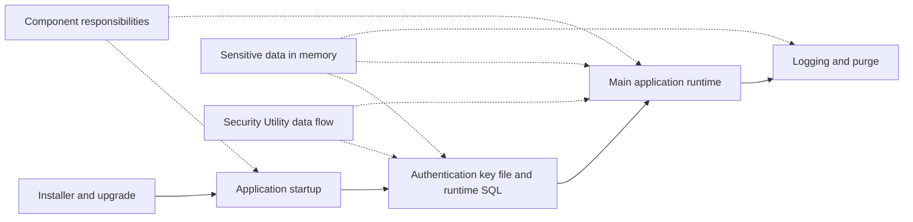
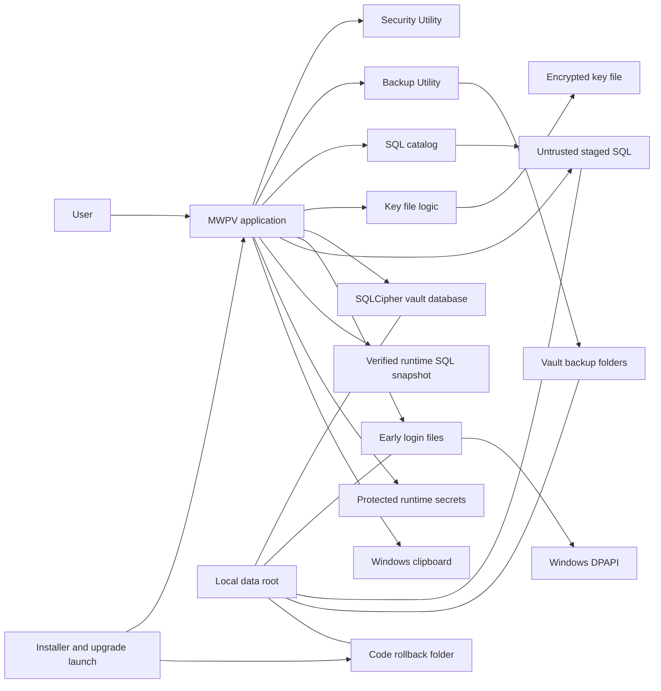
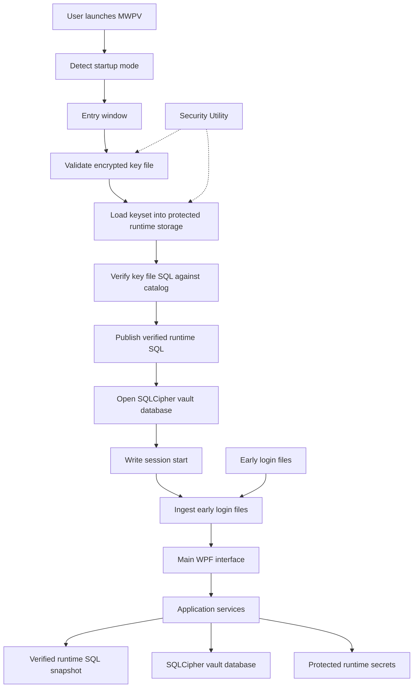
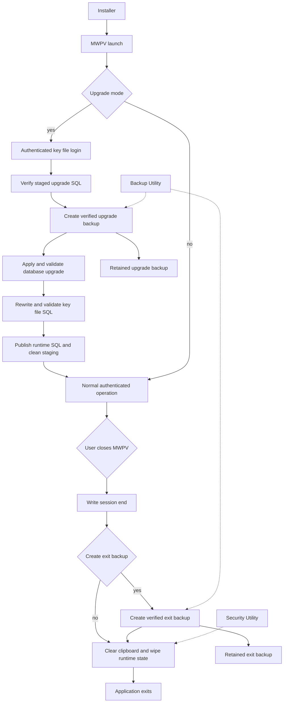

# MWPV High-Level Architecture and Flow

## Purpose and Scope

This document gives a deliberately broad view of the MWPV WPF application's authenticated startup, runtime, upgrade, backup, and shutdown responsibilities. It reflects the current solution structure and runtime paths; it is not a class or method-level design.

## Documentation map

Use this map for the primary reading order. The diagram is an orientation aid only; the table is the reliable GitHub navigation surface.

| Reading order | Document | Role |
|---|---|---|
| 1 | [Installer upgrade and rollback](./MWPV_Installer_Upgrade_and_Rollback_Flow.md) | Installation, upgrade staging, backups, rollback boundaries, and manual recovery |
| 2 | [Authentication key file and runtime SQL](./MWPV_Authentication_KeyFile_and_Runtime_SQL_Flow.md) | Startup modes, `.pv`, V2 keyset, catalog verification, runtime SQL, and SQLCipher entry |
| 3 | [Logging lifecycle and purge](./MWPV_Logging_Lifecycle_and_Purge_Flow.md) | Normal logging, early DPAPI logs, display, retention, purge, and audit boundaries |
| Cross-cutting | [Component responsibilities and trust boundaries](./MWPV_Component_Responsibilities_and_Trust_Boundaries.md) | Ownership and prohibited responsibilities |
| Cross-cutting | [Sensitive data in memory](./MWPV_Sensitive_Data_In_Memory_Flow.md) | MWPV-side plaintext, wiping, UI, and clipboard lifecycle |
| Cross-cutting | [Security Utility data flow](./Security_Utility_Data_Flow.md) | Reusable cryptography, protected store, result, and wipe mechanics |

## System Context

Staged SQL is transport input and is not trusted until `MWPV.SqlCatalog` verifies the required filenames, content, and hashes. `RuntimeSqlStore` is a read-only in-process snapshot that receives only verified SQL.

## Startup and Normal Runtime Flow

## Upgrade, Backup, and Shutdown Flow

Verified upgrade backups are retained for manual recovery where applicable. Automatic upgrade vault restore is not current behavior.

## Component Responsibilities

| Component | High-level responsibility |
|---|---|
| MWPV | WPF entry, startup-mode selection, authenticated runtime, application services, session logging, and shutdown coordination. |
| Security.Utility | Cryptographic helpers, validation results, protected in-process secret storage, sensitive-data wiping, and secure-deletion support. |
| Backup.Utility | Creates and verifies backup sets, writes and verifies manifests, applies retention where requested, and exposes generic restore capability. MWPV retains verified upgrade backups for manual recovery rather than automatically restoring vault data. |
| SQL catalog/runtime SQL components | `MWPV.SqlCatalog` defines trusted SQL hashes and upgrade routes; MWPV validates SQL and exposes only verified SQL through the runtime store. |
| Password database | SQLCipher `MWPV.db` contains vault application data, settings, and audit logs. |
| Key-file database | Encrypted SQLite key-file database stores the keyset payload, including the database password, runtime keys, and trusted SQL payload. |
| Logging | Session and audit logs are written through the application log service to the password database; pre-authentication failures are DPAPI-protected `.elogp` files and are ingested after successful login. |
| Installer | Installs the published application, stages SQL transport input, creates code rollback material under `<data-root>\Rollback\code`, and for an update migration launches MWPV with the migration marker that selects upgrade mode. |

## Important Boundaries

- **Password and key-file authentication boundary:** the entry flow validates the encrypted key-file password, schema, and payload before using its keyset to open the password database.
- **Trusted SQL integrity boundary:** staged and key-file SQL are accepted only after `MWPV.SqlCatalog` validates the required files and SHA-256 hashes; the runtime store receives the verified payload.
- **DLL responsibility boundaries:** MWPV owns application workflow and UI; `Security.Utility` owns reusable security primitives and cleanup; `Backup.Utility` owns backup-set creation, verification, manifests, and retention.
- **Database and filesystem boundary:** the SQLCipher password database, key-file database, early-login files, SQL staging, and backup folders are filesystem-backed; secret material used during a session is held in protected runtime storage.
- **Backup verification and publication boundary:** upgrade and exit backups are created before they are treated as usable; manifests and file hashes are verified, and retention is applied to exit backups.
- **Shutdown cleanup boundary:** close handling writes the session-end log, may complete a verified exit backup, clears clipboard data owned by MWPV, and performs best-effort sensitive-runtime cleanup before exit.

## Deliberate Omissions

This document intentionally omits class-level design, database schemas, individual screens, individual SQL scripts, and detailed exception paths.
