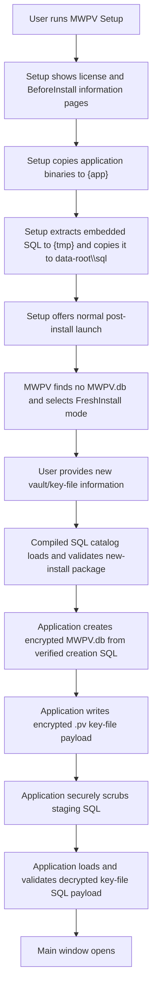
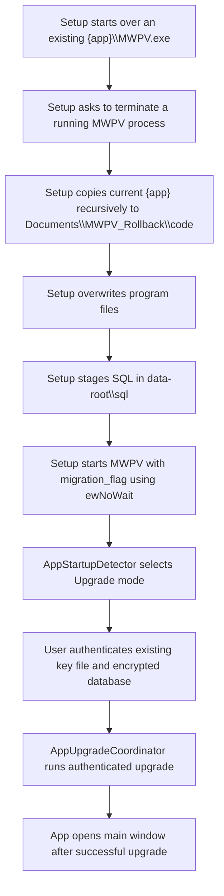
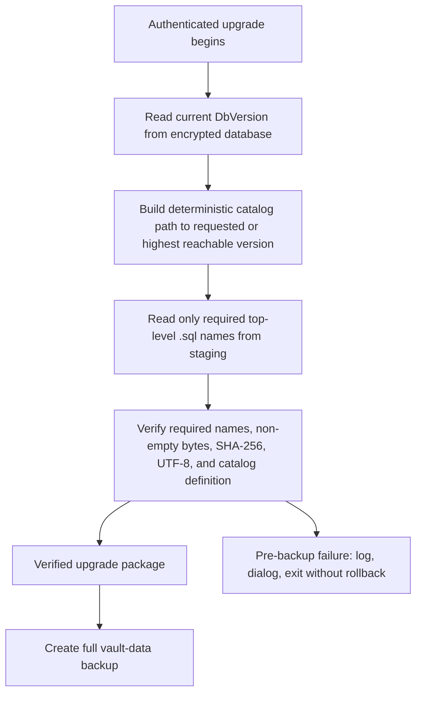
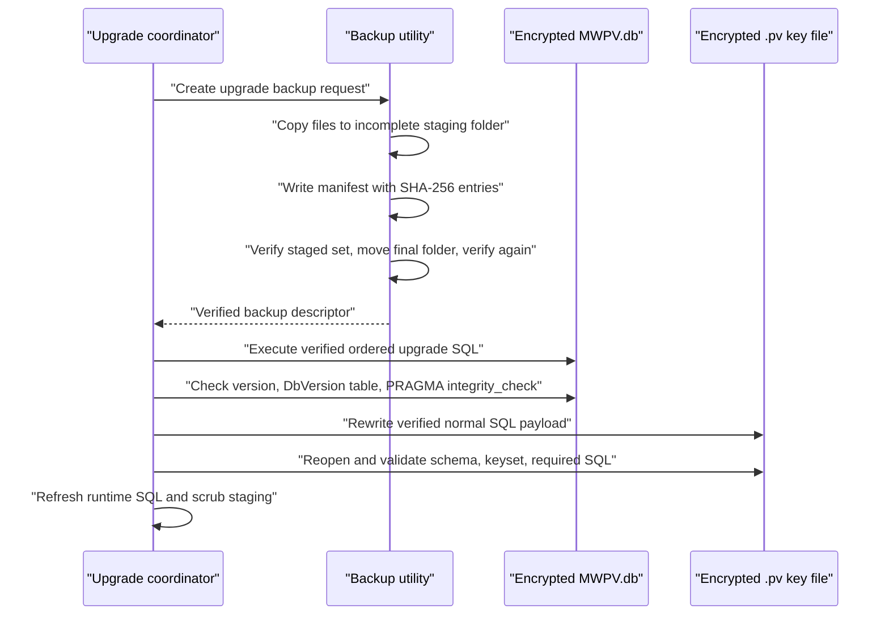
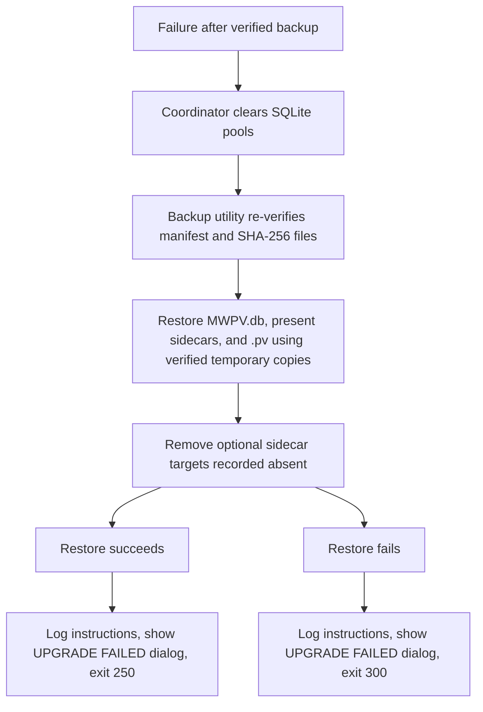
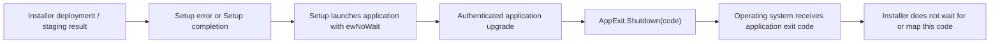

# MWPV Installer, Upgrade, and Rollback Flow

This document describes the implemented beta flow as of the current repository state. It distinguishes installer deployment from the authenticated, in-application vault upgrade. It does not describe a hypothetical restore service beyond the automatic restore that is present in `AppUpgradeCoordinator`.

Related documents: [high-level flow](MWPV_High_Level_Flow.md), [component responsibilities and trust boundaries](MWPV_Component_Responsibilities_and_Trust_Boundaries.md), [sensitive data in memory](MWPV_Sensitive_Data_In_Memory_Flow.md), and [Security.Utility data flow](Security_Utility_Data_Flow.md).

## Scope and responsibility boundary

The Inno Setup executable deploys application files and transports SQL files to the selected data root. It detects an update by finding `{app}\MWPV.exe`, backs up the old application directory, and launches the new application with the legacy `migration_flag` argument when `MWPV.db` is present. It launches with `ewNoWait`, so it cannot receive, interpret, or act on the application's eventual exit code (`Installer/MWPV_Installer.iss:376-403, 415-447`).

The application determines whether that argument (or an upgrade flag file) means upgrade mode, authenticates the user, and then owns SQL validation, vault-data backup, migration, post-upgrade validation, automatic vault-data rollback, logging, dialogs, and the process exit code (`MWPV/Services/AppLifecycle/AppStartupDetector.cs:14-38`; `MWPV/Utilities/Security/AppEntryWindow.xaml.cs:435-469`).

| Component | Responsibility | Inputs | Outputs | Failure behavior | Next boundary |
|---|---|---|---|---|---|
| Inno Setup | Present pages; stop MWPV; deploy binaries; stage SQL; back up/restore old code during deployment failure | Installer payload, selected install location | `{app}` binaries, staged SQL, optional code rollback copy | Shows Setup error and aborts; restores code only if deployment/staging fails | Application launch |
| Staged installer files | Untrusted transport of `*.sql` from Setup temp directory to the data root | Embedded SQL | `<data-root>\sql\*.sql` | Copy/extract failure aborts installer | SQL catalog |
| MWPV startup / entry window | Detect run mode, authenticate, build a new vault or invoke authenticated upgrade | Arguments, DB existence, upgrade pending file, user credentials | Main-window launch or process shutdown | Authentication and startup errors remain application failures | Coordinator / new-install services |
| `AppUpgradeCoordinator` | Orchestrate validation, backup, migration, validation, cleanup, rollback, logging | Authenticated DB and key-file credentials, staged path | `UpgradeResult` and final code | Pre-backup failure has no rollback; later failure triggers rollback | Backup, executor, key-file service |
| `MWPV.SqlCatalog` DLL | Define names, SHA-256 hashes, roles, deterministic order, and upgrade graph | Candidate staged SQL bytes | Verified new-install or upgrade package | Rejects missing, changed, empty, duplicate, invalid UTF-8, unsupported-path files | New-install code / executor |
| Backup utility | Create and verify full vault-data set; restore it on request | DB, optional sidecars, `.pv` key file | Timestamped folder and `manifest.json` | Creation/verification failure stops upgrade; restore failure is reported | Coordinator |
| `DbUpgradeExecutor` | Execute verified ordered SQL and validate DB version/schema/integrity | Verified package and encrypted DB | Step result | Causes rollback after a backup exists | Coordinator |
| Rollback logic | Restore verified vault-data files and absent optional-sidecar state | Upgrade backup set and original paths | Restored DB/key file or failure result | Does not restore program binaries; failed rollback remains manual recovery | User/log |
| Final user-visible result | Report status through popup/log/process code | `UpgradeResult` | Main window on success; fatal dialog and shutdown on failure | Installer itself is already finished and does not consume the code | User/support |

## Clean new installation

Setup includes SQL as `dontcopy` transport files and copies application publish output to `{app}` (`Installer/MWPV_Installer.iss:64-67`). For a clean installation, Setup does not mark the install as an update and displays the usual post-install launch checkbox (`Installer/MWPV_Installer.iss:393-403`). The data root is `%LocalAppData%\MWPV` when the application is installed on the system drive; otherwise it is `<selected-drive>\AppData\Local\MWPV` (`Installer/MWPV_Installer.iss:275-290`).

Fresh-install mode is selected only when `DatabaseHelper.GetAppDbPath()` does not exist (`MWPV/Services/AppLifecycle/AppStartupDetector.cs:31-34`). Before database creation, the entry window loads and validates the complete new-install package from the staging directory (`MWPV/Utilities/Security/AppEntryWindow.xaml.cs:337`). `ServiceSetUp` executes only the verified creation script to initialize the encrypted database, then creates the key-file payload from the verified normal SQL payload (`MWPV/Utilities/Security/ServiceSetUp.cs:73-108`, `112-180`). It scrubs staging after key-file creation (including best-effort cleanup on that path). A subsequent run validates the decrypted key-file payload before populating `RuntimeSqlStore`.

## Existing installation and application-upgrade startup

The installer detects an update from the pre-existing executable, not from the data file (`Installer/MWPV_Installer.iss:420-424`). It asks to terminate a detected running process; refusal, task-kill failure, or timeout aborts Setup (`85-159`). Before overwriting code, it deletes the previous code rollback directory and recursively copies the existing application folder to `%UserProfile%\Documents\MWPV_Rollback\code` (`161-246`). That code copy is not manifest-hashed or post-copy verified.

After a successful update deployment, Setup starts MWPV with `migration_flag` only if `MWPV.db` exists in the computed data root (`376-391`, `415-440`). `AppStartupDetector` recognizes that legacy argument as an upgrade request, as well as `--upgrade`, `--migration`, `--migration-flag=<path>`, and `--target-version=<version>` (`MWPV/Services/AppLifecycle/AppStartupDetector.cs:7-78`). An existing `upgrade.pending.json` also selects upgrade mode at startup (`MWPV/App.xaml.cs:39-46`).

The upgrade does not run until the existing key file/password have been validated and session key material loaded. The entry window invokes `RunAuthenticatedUpgrade`, assigns its result to `AppExit`, displays a fatal upgrade dialog on failure, and calls application shutdown with the final code (`MWPV/Utilities/Security/AppEntryWindow.xaml.cs:435-456`). On success it refreshes the in-memory keyset because the key-file payload was rewritten, then validates the decrypted runtime package again (`457-469`).

## Pre-upgrade SQL and package validation

The coordinator reads the current version before it creates a backup and calls `TrustedSqlCatalog.LoadAndValidateUpgradeDirectory` before backup creation (`MWPV/Services/Upgrade/AppUpgradeCoordinator.cs:159-172`). This ordering is intentional: an invalid transport package cannot trigger a backup or any mutation.

The compiled `MWPV.SqlCatalog` is the authority for exact filenames, SHA-256 digests, roles, stable ordering, and allowed version transitions (`MWPV/MWPV.SqlCatalog/TrustedSqlCatalog.cs:10-24`, `28-55`). Directory loading enumerates only top-level `.sql` files whose names are required by the catalog/package plan. Thus unrelated staged files are ignored in this directory-loading path; they do not enter the verified package. Required files must be present, non-empty, byte-for-byte hash matched, and strict UTF-8 decoded. The in-memory validation API rejects unknown candidates and duplicate names (`55-67`; `MWPV/MWPV.SqlCatalog/SqlCatalogModels.cs:6-12`).

New-install and upgrade packages are deliberately distinct. A new-install package contains the database-creation and normal operational scripts. An upgrade package contains the normal scripts needed for the reloaded key-file payload plus only the ordered upgrade scripts along the catalog path; it rejects invalid versions, downgrade requests, ambiguous paths, unsupported current versions, or no valid requested route (`TrustedSqlCatalog.cs:27-54`, `80-110`). Upgrade scripts are not part of the new-install payload and normal operational scripts are not themselves upgrade edges.

## Backup and ordered migration

The coordinator requests backup type `Upgrade` with prefix `MWPV_Backup` under `<data-root>\upgrade-backups` (`MWPV/Services/Upgrade/AppUpgradeCoordinator.cs:363-377`). The requested files are:

- required `MWPV.db` as `files/MWPV.db`;
- optional `MWPV.db-wal`, `MWPV.db-shm`, and `MWPV.db-journal` as named sidecars; and
- required encrypted key-file database as `files/KeyFileDatabase.pv`.

`BackupService` allocates a timestamped final directory, writes first to a hidden `.incomplete-<GUID>` folder, captures per-file sizes and SHA-256 values in `manifest.json`, verifies the staged folder, atomically moves it to final, and verifies again (`Backup.Utility/BackupService.cs:31-104`, `196-237`). Any backup creation or verification failure returns code 101, logs manual recovery instructions, and does **not** attempt rollback because no accepted backup set exists (`AppUpgradeCoordinator.cs:172-195`). This upgrade path does not call retention/trimming, so upgrade backups are retained indefinitely by this workflow; the utility has a separate retention API but it is not invoked here.

`DbUpgradeExecutor` opens the encrypted database and executes each catalog-ordered verified upgrade script in order. It does not wrap the entire list in an application-level transaction (`MWPV/Services/Upgrade/DbUpgradeExecutor.cs:23-70`). Post-execution validation rereads the version, checks `DbVersion`, and runs `PRAGMA integrity_check` (`74-140`). The key-file service replaces its SQL map from the verified normal-payload package, saves it, reopens it, validates key-file schema and JSON, and verifies the required SQL names (`MWPV/Services/Upgrade/KeyFileUpgradeService.cs:19-88`, `93-184`).

## Failure, rollback, and completion

Rollback is triggered for a failure after the verified backup is created: SQL execution, database validation, key-file rewrite, key-file validation, or an unexpected exception after backup. The coordinator clears SQLite connection pools and restores the backup as type `Upgrade` to the original DB and key-file locations. It removes a current optional sidecar if the manifest records it was absent (`MWPV/Services/Upgrade/AppUpgradeCoordinator.cs:380-406`). The backup utility verifies the set before restoration, verifies each temporary restored copy and the final target SHA-256, and cleans temporary restore files (`Backup.Utility/BackupService.cs:155-194`).

Successful rollback produces final code 250 with the underlying failing detail code preserved in the log/result. Failed rollback produces 300. The UI always shows `UPGRADE FAILED`, gives the log location and final code, and tells the user to review rollback instructions (`MWPV/Utilities/Helpers/UpgradeFailurePopupHelper.cs:26-80`; `MWPV/Services/Upgrade/UpgradeLogger.cs:29-124`). Those instructions include manual restoration locations for vault data, key file, and the installer-created code copy. Manual recovery is not represented here as an automated restore flow.

On success, the application replaces the runtime SQL with verified payload scripts, tries to securely scrub the staging directory (cleanup failure is logged but does not reverse success), tries to delete an upgrade flag file (flag-clear failure is only logged), reports code 0, and transitions runtime mode back to normal (`MWPV/Services/Upgrade/AppUpgradeCoordinator.cs:229-244`; `UpgradeFlagService.cs:9-27`).

## Installer/application return-code handling

| Value | Implemented meaning | Produced/consumed by |
|---:|---|---|
| 0 | Success | App completion; default `AppExitCode.Success` |
| 10 | User cancelled/closed entry/login window | Application |
| 11 | Authentication failure enum value | Defined, but no direct assignment found in the inspected upgrade/startup path |
| 12-19 | Unused | No enum values defined |
| 20 | Fresh install failed | Defined; no direct assignment found in the inspected path |
| 21-29 | Unused | No enum values defined |
| 30 | Startup key-file invalid | Defined |
| 31 | Startup encrypted DB open failure | `DatabaseHelper` calls shutdown with it |
| 32 | Startup SQL catalog missing | Defined |
| 100 | Upgrade SQL catalog/context failure | Coordinator pre-backup failure |
| 101 | Upgrade backup-set creation or verification failure | Coordinator pre-backup failure |
| 102 | Cannot read current database version | Version reader/coordinator |
| 103 | Upgrade plan invalid | Defined by executor placeholder; catalog route errors currently surface as 100 instead |
| 104-109 | Unused | No enum values defined |
| 110 | SQL upgrade execution failure | Detail code; final is normally 250 or 300 after rollback |
| 111-119 | Unused | No enum values defined |
| 120 | Database post-upgrade validation failure | Detail code; final is normally 250 or 300 |
| 121-199 | Unused | No enum values defined |
| 210 | Key-file SQL-payload rewrite failure | Detail code; outside the stated 100-199 range |
| 220 | Key-file post-rewrite validation failure | Detail code; outside the stated 100-199 range |
| 250 | Upgrade failed but automatic rollback succeeded | Final application exit code |
| 300 | Automatic rollback failed | Final application exit code |
| 900 / 999 | Unhandled / unknown fatal application errors | Application |

The actual enum is `MWPV/Services/AppLifecycle/AppExitCode.cs:3-30`. The requested summaries are therefore incomplete: authentication-related values currently include 10 and 11, not the entire 10-19 range; SQL/migration values also include key-file detail values 210 and 220. Crucially, because Setup calls `Exec(..., ewNoWait, ...)`, application codes reach the operating system but are not handled by Inno Setup (`Installer/MWPV_Installer.iss:402-413`).

## File and data movement

| Item | Source | Destination | When | Verified | Temporary / cleanup |
|---|---|---|---|---|---|
| Installer source files | Installer build inputs | Setup executable | Build time | No signing verification in script | Setup artifact output is rebuilt by script |
| Application binaries | `MWPV/bin/Release/net8.0-windows/publish` | `{app}` | Setup install/update | No hash/copy verification in script | Persist; code backup exists for updates |
| Staged SQL | Embedded `MWPV/sql/*.sql` | `<data-root>\sql` via `{tmp}` | Post-install | No installer hash verification; app catalog verifies required bytes before use | `{tmp}` is Setup temporary; data-root staging is scrubbed after successful vault setup/upgrade where implemented |
| Password database | Existing `<data-root>\MWPV.db` | Upgrade backup `files/MWPV.db`; restored to source | Before upgrade / rollback | SHA-256 manifest and restore checks | Backup retained by this flow |
| DB sidecars | `-wal`, `-shm`, `-journal` | Named backup files | Before upgrade / rollback | SHA-256 if present; absent state is recorded | Restore removes a target when recorded absent |
| Encrypted key-file database | User-selected `.pv` path | `files/KeyFileDatabase.pv`; restored to source | Before upgrade / rollback | SHA-256 backup verification; key-file schema/payload validation after rewrite | Backup retained; runtime buffers are cleared where coded |
| Upgrade log | Coordinator | `<data-root>\upgrade\upgrade-<UTC timestamp>.log` | Upgrade | Best effort only; log write does not affect recovery | Retention not implemented here |
| Backup folder | Backup utility staging | `<data-root>\upgrade-backups\MWPV_Backup...` | Before mutation | Manifest SHA-256 verified before and after final move | Hidden incomplete folder is cleaned on failure where possible; final set retained |
| Manifest | Backup utility | `manifest.json` in backup folder | During backup | Its contents and each file are checked; manifest itself is not cryptographically signed | Retained with backup |
| Rollback code copy | Existing `{app}` | `Documents\MWPV_Rollback\code` | Before update overwrite | Not hash/manifest verified | Previous copy is deleted before a new copy; retained after install |
| Upgrade flags | Argument or `<data-root>\upgrade.pending.json` | Application startup context | At startup | No signature/authentication | File is deleted on successful upgrade when supplied; delete failure is logged only |

## User-visible stages and messages

- Setup uses the license and `BeforeInstall.txt` information pages, shows a running-process termination prompt, reports Setup copy/staging/restore errors, and only presents the normal post-install launch checkbox for a non-update.
- Update Setup launches the application automatically after SQL staging. It does not display app-upgrade progress or app exit codes.
- The app requires a valid key file/password before upgrading. Authentication failure is shown by existing entry-window behavior rather than an installer dialog.
- Successful application upgrade publishes “Upgrade completed successfully.” and continues to the main window.
- Failed upgrade shows a fatal `UPGRADE FAILED` dialog with the log path and final code. The log contains automatic rollback status and manual recovery locations.

## Security Boundaries and Integrity Guarantees

The installer script has no signing directives. Consequently this repository configuration represents an unsigned installer; SmartScreen may show unknown-publisher/reputation warnings. No claim of Authenticode trust is warranted from the current script.

Staged SQL is untrusted transport. The installer merely extracts/copies it. The application selects the data root, asks the compiled catalog for precisely required names, verifies raw-byte SHA-256 values, decodes strict UTF-8, and executes only the verified catalog package. Extras are ignored by the directory adapter but direct in-memory candidate validation rejects unknown names. This protects the application’s use of SQL after startup, but it does not authenticate the installer executable, the staged directory itself, the backup manifest, or the installer code backup.

The password database is opened as an encrypted SQLCipher connection and the `.pv` key-file payload is handled through Security.Utility/KeyFileStore boundaries. Backup integrity is SHA-256 verification, not a signed or MAC-authenticated backup manifest. The key-file is reopened and revalidated after its payload is rewritten. Rollback restores vault data and the key file only; it does not automatically restore installer-deployed application binaries. The installer code copy is an unauthenticated convenience copy for manual recovery.

## Failure Modes and Recovery Expectations

| Failure path | Classification | Implemented outcome |
|---|---|---|
| Setup cannot stop MWPV, back up old code, deploy, or stage SQL | Automatically recoverable only where Setup restores code after deployment/staging failure | Setup shows error/aborts; staging failure invokes code-folder copy-back when available |
| Authentication/key-file validation fails before coordinator | Manual retry/recovery required | No data migration or coordinator rollback occurs |
| Current-version/catalog/package failure before backup | Manual recovery required, but no data mutation expected | Code 100/102; log and dialog; no automatic rollback |
| Backup create/verify failure | Manual recovery required, but no migration attempted | Code 101; no automatic rollback |
| SQL execution, DB validation, key rewrite/validation failure after backup | Rollback attempted | Restore DB, sidecars, and `.pv`; final 250 on success, 300 on failure |
| Rollback succeeds | Rollback completed | Vault data and key-file restored from verified backup; program binaries remain the new version |
| Rollback fails | Unrecoverable from the installer alone | Code 300; follow log’s manual restore instructions from backup and code-copy locations |
| SQL staging cleanup or upgrade-flag deletion fails after success | Automatically recoverable / maintenance issue | Upgrade stays successful; staged SQL or flag may remain |

## Review Findings, Resolved Issues, and Remaining Limitations

Verified strengths include validation before backup, a compiled raw-byte SQL hash catalog, deterministic upgrade routing, a full DB/key-file backup that includes SQLite sidecars and verifies SHA-256 before restore, post-migration DB integrity checking, key-file reload/validation, and automatic vault-data rollback after a post-backup failure.

The current code also contains corrected/implemented rollback mechanics: rollback clears SQLite pools, restores all tracked vault roles (including absence of optional sidecars), verifies temporary and final targets, and distinguishes successful rollback (250) from failed rollback (300). SQL staging cleanup is now attempted after successful upgrade rather than being assumed complete.

Remaining limitations and beta issues:

1. **Correct before next beta:** Setup does not wait for the app and cannot display or act on 250/300 or any other application code. A user can see installer completion while the authenticated migration later fails. This is a documented behavior gap, not an installer/application return-code handoff.
2. **Correct before next beta:** The existing code rollback copy is deleted before a new copy and is neither atomically created nor integrity verified. It is a manual fallback, not a verified rollback artifact.
3. **Correct before next beta:** The installer is unsigned in the inspected script, so SmartScreen/unknown-publisher behavior is expected and no installer authenticity guarantee exists.
4. **Clarify or correct:** `UpgradePlanInvalid` (103) is defined but the active catalog-plan validation path maps failures to 100; the placeholder methods still claim planning/execution is unimplemented although executable implementations exist. This makes code-level diagnosis less precise.
5. **Clarify or correct:** A failed staging scrub or upgrade-flag delete is nonfatal. Retained staged transport SQL or a retained flag can affect later startup/maintenance and should be made visible/managed.
6. **Unverifiable from this code alone:** backup retention policy for upgrade backups is not invoked by the upgrade coordinator; final backup retention is therefore indefinite in this flow.

