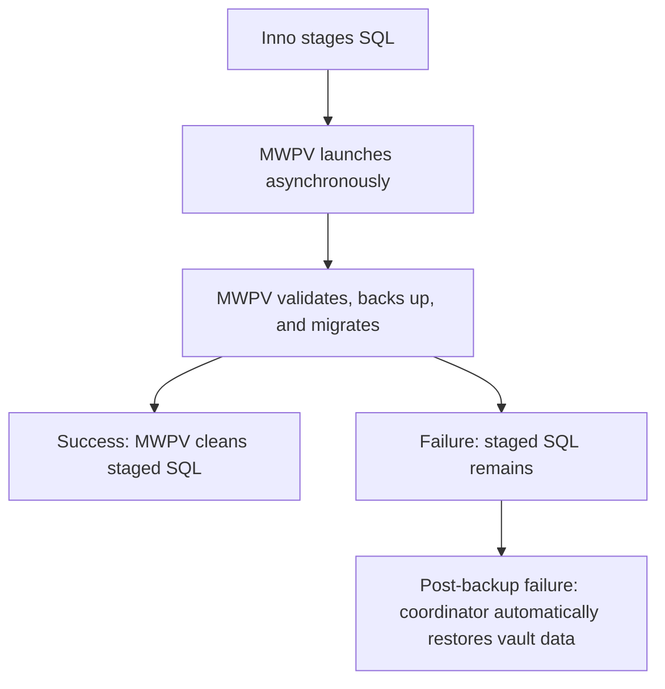
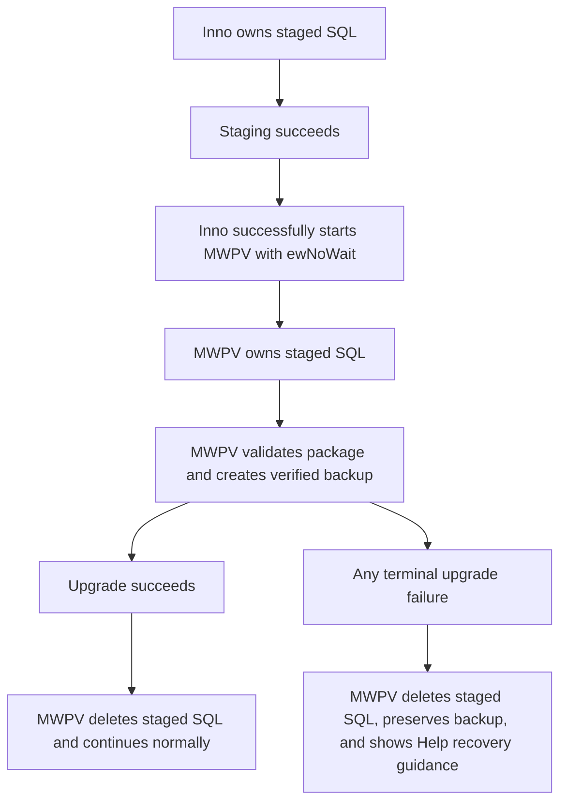
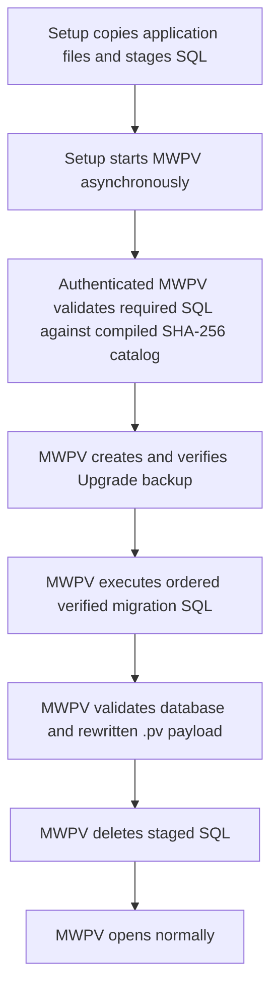
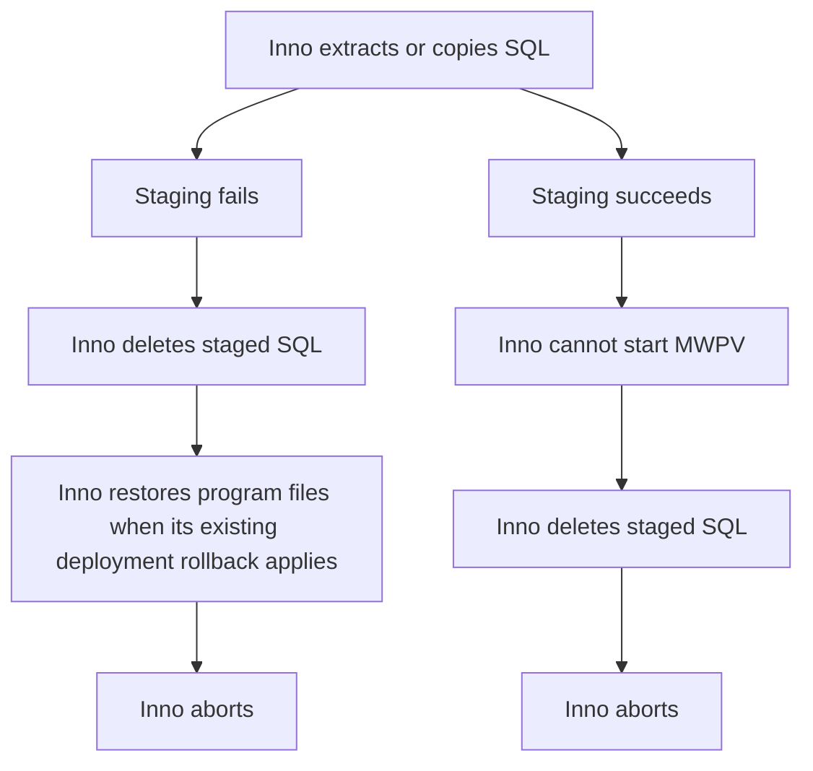
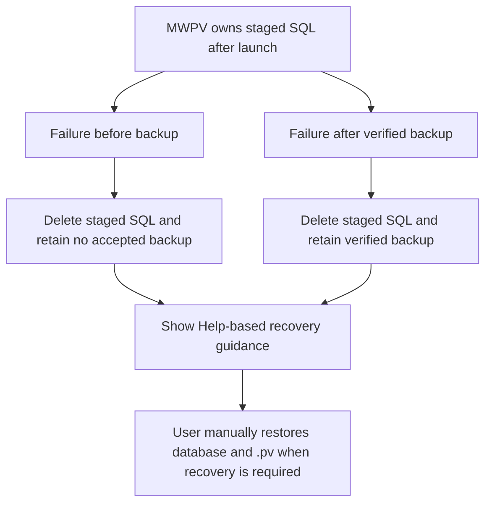
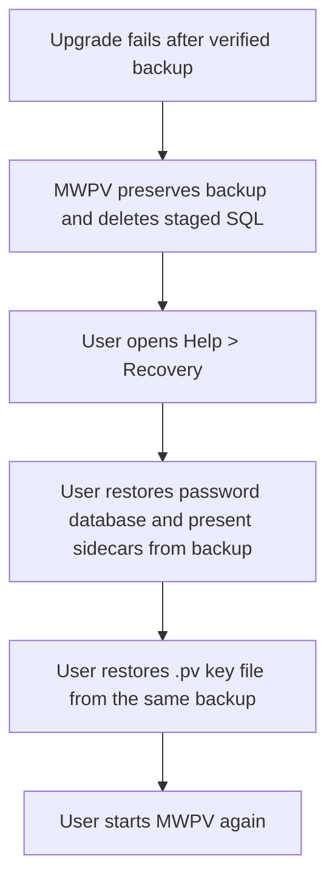

# MWPV Installer, Upgrade, and Rollback Flow

## Change record and scope

This is a design-and-implementation record for staged-SQL ownership and upgrade recovery. It documents both the superseded behavior and the implemented replacement. It covers the current code only.

Companion documents: [high-level flow](MWPV_High_Level_Flow.md), [component responsibilities and trust boundaries](MWPV_Component_Responsibilities_and_Trust_Boundaries.md), [sensitive data in memory](MWPV_Sensitive_Data_In_Memory_Flow.md), and [Security.Utility data flow](Security_Utility_Data_Flow.md).

### Change history

| Change | Status | Summary |
|---|---|---|
| Staged SQL ownership and manual vault recovery | Implemented | Inno cleans staged SQL on staging/launch failure. MWPV cleans it on every terminal upgrade outcome. Automatic vault-data restore was removed; verified backups are retained for manual database and `.pv` restoration. |
| Installer program-file backup co-location | Implemented | The installer code rollback copy moved from Documents to `Rollback\code` beneath the same resolved MWPV data root as the vault and upgrade backups. |
| Installer/application execution model | Intentionally unchanged | Setup remains asynchronous (`ewNoWait`), does not wait for MWPV, and does not interpret MWPV exit codes. No handshake was added. |

## Previous behavior and problem discovered

Previously, Inno copied SQL from its temporary extraction folder to `<data-root>\sql` and cleaned that folder only when `StageMwpvSqlFiles` failed. If staging succeeded but MWPV could not be launched, SQL could remain. MWPV cleaned the staged directory only at the end of a successful upgrade. Catalog failure, backup failure, migration failure, key-file failure, validation failure, authentication/startup cancellation, and unexpected failure left staged SQL behind.

The prior coordinator also created a verified upgrade backup and then automatically restored the database, sidecars, and `.pv` file after a post-backup failure. It used final codes 250 or 300 to express automatic restore outcome. That was inconsistent with the intended recovery model: the installer’s program-file copy and vault-data recovery are distinct responsibilities, and recovery instructions need to guide the user through a deliberate manual restore from the verified vault backup.

The old user popup said rollback instructions were in the upgrade log and displayed an internal log path and code. This was incomplete as user guidance and exposed implementation details that are not needed to begin recovery.

## Design decision and rationale

### Exact ownership boundary

- **Before successful MWPV process launch:** Inno owns the staged SQL transport files.
- **After successful MWPV process launch:** MWPV owns the staged SQL transport files and the upgrade attempt.

Successful `Exec` creation is the ownership boundary because the existing architecture deliberately launches MWPV with `ewNoWait`. It is not an acknowledgement that MWPV has completed startup. No installer/application handshake, wait, exit-code mapping, or migration redesign was introduced. If MWPV terminates shortly after launch, its shutdown cleanup is responsible for deleting its staged SQL.

This matches existing layering: Setup transports application assets and starts the process; authenticated application startup owns vault credentials, SQL validation, backup, migration, cleanup, failure reporting, and recovery guidance. It avoids assigning vault-data decisions to Inno or allowing Inno to infer an application result asynchronously.

### Recovery decision

Automatic restoration of vault data was removed. Before any mutation, MWPV still creates and verifies an `Upgrade` backup containing the encrypted password database, present SQLite sidecars, and the encrypted `.pv` key file. The backup is retained after success or failure. On a failure after backup, MWPV leaves the current vault state untouched by restore logic, deletes staged SQL, logs the original failure, and directs the user to Help for manual restoration of **both** the database and `.pv` file from that verified backup.

This preserves the existing backup integrity guarantees without silently overwriting files after a failed migration. Installer program-file rollback remains an independent, installer-owned deployment fallback; it is not vault-data recovery.

## Before-and-after flow

### Superseded flow

The previous design was incomplete because cleanup was success-only in MWPV and launch failure was outside Inno’s cleanup branch. Automatic restore also blurred the separation between installer code rollback and vault recovery.

### Implemented final flow

## Normal success flow

The SQL catalog still determines required filenames, byte hashes, strict UTF-8 decoding, and ordered upgrade path before backup (`MWPV/MWPV.SqlCatalog/TrustedSqlCatalog.cs:28-67`). The coordinator creates the verified backup before database mutation and validates the database and key-file payload after migration (`MWPV/Services/Upgrade/AppUpgradeCoordinator.cs:159-227`). It then deletes the staged SQL files; a cleanup failure is logged without changing the successful upgrade result (`229-240`).

## Installer failure flow

`CleanupMwpvSqlStagingFolder` now returns success/failure while deleting every child item under `<data-root>\sql` (`Installer/MWPV_Installer.iss:288-320`). Setup invokes it for staging failure and reports if not all staged SQL could be deleted (`435-443`). `LaunchMwpvAfterUpdate` invokes the same cleanup when `Exec` cannot create MWPV, resets deployment success so existing code-folder recovery remains available, then aborts (`401-420`).

### Program-file rollback location change

**Previous behavior:** Inno copied `{app}` to `%UserProfile%\Documents\MWPV_Rollback\code`. This scattered program-file recovery material away from the MWPV data root, upgrade backup sets, and staging location.

**Implemented behavior:** `GetMwpvRollbackCodeFolder` now calls the existing `GetMwpvDataFolder` resolver and appends `Rollback\code`; it does not calculate another root (`Installer/MWPV_Installer.iss:161-166`, `277-283`). Therefore the installer code-backup path is:

- system-drive install: `%LOCALAPPDATA%\MWPV\Rollback\code`;
- portable install: `<exe drive>\AppData\Local\MWPV\Rollback\code`.

Backup creation, deletion of the previous code backup, restore source selection, and error messages all continue to use this one helper (`Installer/MWPV_Installer.iss:215-246`). MWPV’s manual-recovery logging resolves the same data-root-relative location from `DatabaseHelper.GetAppDbPath()` (`MWPV/Services/Upgrade/AppUpgradeCoordinator.cs:74-110`, `386-391`).

This co-locates recovery material without merging responsibilities. The `Rollback\code` copy remains an installer-owned program-file fallback. The verified `<data-root>\upgrade-backups\...` sets remain application-owned vault-data backups for manual restoration of the database and `.pv` file. Neither backup substitutes for the other.

## MWPV failure flow

`PreBackupFailure` deletes staged SQL before recording the original failure. `CompletePostBackupFailure` replaces the prior automatic restore branches: it deletes staged SQL, retains the verified backup, retains the original step failure as the final result, and records manual recovery instructions (`MWPV/Services/Upgrade/AppUpgradeCoordinator.cs:273-360`). `RestoreBackupSet` is no longer part of the coordinator flow.

Application shutdown also attempts cleanup while startup remains in Upgrade mode. This covers terminal pre-coordinator exits such as authentication/key-file validation failure or closing the entry flow. A shutdown cleanup failure is written to early logging; it never replaces the original application result (`MWPV/App.xaml.cs:247-310`). A successful coordinator upgrade transitions startup mode to Normal before exit, so it is not reclassified as a failed upgrade.

### Failure matrix

| Failure category | Backup state | Staged SQL handling | Vault-data handling | User-visible result |
|---|---|---|---|---|
| Inno extract/copy staging failure | No MWPV backup | Inno deletes it and aborts | No migration began | Setup error |
| Inno cannot launch MWPV | No MWPV backup | Inno deletes it and aborts | No migration began | Setup error |
| Authentication/key-file/startup exit in Upgrade mode | No coordinator backup | MWPV shutdown deletes it | No migration began | Existing startup/authentication error |
| Current-version or catalog validation failure | No accepted backup | Coordinator deletes it | No migration began | Common upgrade failure guidance |
| Backup creation/verification failure | No accepted backup | Coordinator deletes it | No migration began | Common upgrade failure guidance |
| SQL migration failure | Verified backup retained | Coordinator deletes it | No automatic restore | Common upgrade failure guidance; use Help |
| Database validation failure | Verified backup retained | Coordinator deletes it | No automatic restore | Common upgrade failure guidance; use Help |
| Key-file rewrite/validation failure | Verified backup retained | Coordinator deletes it | No automatic restore | Common upgrade failure guidance; use Help |
| Unexpected coordinator exception | Depends on whether backup completed | Coordinator deletes it | No automatic restore | Common upgrade failure guidance; use Help |
| Staged-SQL cleanup failure | Original result unchanged | Failure is logged | No additional vault action | Original success/failure remains authoritative |

## Manual recovery flow

The backup request remains type `Upgrade` and includes `MWPV.db`, present `-wal`, `-shm`, and `-journal` sidecars, and the `.pv` key-file database (`MWPV/Services/Upgrade/AppUpgradeCoordinator.cs:363-377`). `BackupService` writes a manifest with SHA-256 values, verifies before finalization, and verifies the final set (`Backup.Utility/BackupService.cs:31-104`, `196-237`). No retention/trimming call is made by the upgrade coordinator. This is intentional: verified upgrade backups remain available for manual recovery instead of being removed automatically.

The application log records manual recovery context. The user-facing popup does not disclose log paths, backup paths, database paths, passwords, keys, SQL contents, or exception details. It says: “Open Help > Recovery and follow the manual recovery instructions before trying again. Restore both the vault database and the .pv key file from the verified upgrade backup when Help directs you to do so.” (`MWPV/Utilities/Helpers/UpgradeFailurePopupHelper.cs:67-75`).

## Responsibility and ownership table

| Component | Ownership / responsibility | Failure behavior | Intentionally unchanged |
|---|---|---|---|
| Inno Setup | Owns transport SQL until it successfully starts MWPV; deploys program files | Deletes staged SQL on staging or launch failure; aborts | `ewNoWait`; no exit-code handling; no handshake |
| Staged SQL folder | Temporary transport of application SQL only | Deleted by the current owner on terminal outcome | SQL catalog remains the integrity authority |
| MWPV startup | Takes ownership after process launch; handles startup/authentication exits | Deletes staged SQL on Upgrade-mode shutdown | Existing login architecture |
| `AppUpgradeCoordinator` | Owns authenticated upgrade, backup, migration, cleanup, and recovery instructions | Deletes staged SQL on every coordinator failure; retains backup | Ordered migrations and validation sequence |
| Backup utility | Creates/verifies an upgrade backup | Retains accepted backup for manual recovery | No coordinator retention cleanup |
| Installer code rollback | Preserves/restores program files at `<data-root>\Rollback\code` during installer deployment failure | Separate from vault-data recovery | Existing code-copy mechanism; shares only the data root |
| User / Help | Performs vault-data recovery when required | Restores both DB and `.pv` from verified backup | No automatic restore |

## Return-code and asynchronous boundary

Inno continues to call `Exec` with `ewNoWait` (`Installer/MWPV_Installer.iss:405-411`). It only knows whether the process was created; it does not wait for MWPV or consume its exit code. This was retained because process coordination would be a materially different installer/application design.

After this change, a post-backup migration/key-file/database failure retains its original application detail code rather than reporting automatic-restore outcomes 250 or 300. `UpgradeFailedRollbackSucceeded` (250) and `UpgradeRollbackFailed` (300) remain defined legacy enum values but are not produced by the coordinator’s removed automatic-restore path (`MWPV/Services/AppLifecycle/AppExitCode.cs:3-30`).

## Security considerations

Staged SQL is application schema/query transport, not vault secrets. It is still untrusted until the compiled SQL catalog verifies required filenames and SHA-256 bytes. Cleanup is described as deleting or cleaning up staged SQL; the cleanup service’s implementation may make best-effort stronger wiping, but neither the recovery design nor user guidance relies on a guarantee of secure deletion.

The installer remains unsigned by intentional current limitation: distribution is local and the source is publicly reviewable. Windows publisher/SmartScreen warnings remain expected; local distribution and reviewability do not authenticate the executable. The installer script has no signing configuration (`Installer/MWPV_Installer.iss:18-59`).

Verified backup integrity is based on the manifest and SHA-256 verification. The backup is not cryptographically signed. The `.pv` file and encrypted database remain separate restoration targets and must be restored together when Help directs recovery.

## Known limitations and intentionally unchanged behavior

- Successful process creation is an ownership boundary, not proof that MWPV reached coordinator code. Upgrade-mode shutdown cleanup addresses early terminal exits, but a power loss can still interrupt cleanup.
- Cleanup failures are logged and do not replace the original upgrade result. Residual transport SQL may remain after filesystem or permission failures.
- Inno’s program-file rollback copy at `<data-root>\Rollback\code` is not a manifest-verified vault-data backup.
- Inno remains asynchronous; no wait, exit-code interpretation, or handshake was introduced.
- Upgrade backup retention is intentionally manual: the coordinator does not automatically trim accepted upgrade backups.
- Existing new-install cleanup remains in `ServiceSetUp`; this change focused on the installer/upgrade ownership boundary.

## Implementation references

- `Installer/MWPV_Installer.iss`: `GetMwpvDataFolder`, `GetMwpvRollbackCodeFolder`, `BackupMwpvAppFolder`, `RestoreMwpvAppFolder`, `CleanupMwpvSqlStagingFolder`, `StageMwpvSqlFiles`, `LaunchMwpvAfterUpdate`, `CurStepChanged`, and `DeinitializeSetup`.
- `MWPV/Services/Upgrade/AppUpgradeCoordinator.cs`: `PreBackupFailure`, `CompletePostBackupFailure`, and `CleanUpStagedSql`.
- `MWPV/App.xaml.cs`: `CleanUpUpgradeStagedSqlOnExit`.
- `MWPV/Utilities/Helpers/UpgradeFailurePopupHelper.cs`: common Help-based failure message.
- `MWPV/Services/Upgrade/UpgradeLogger.cs`: manual recovery record and separation of vault-data and program-file recovery.
- `MWPV/Utilities/Security/SqlStagingCleanupService.cs`: physical staged-SQL cleanup implementation.

## Validation results

- `dotnet build MWPV.csproj --no-restore` completed with **0 errors**. Existing compiler warnings remain.
- Source review confirms `ewNoWait` is retained and no installer application-exit-code handling or handshake was added.
- Source review confirms Inno invokes staged-SQL cleanup on staging and application-launch failure.
- Path review confirms system-drive resolution produces `%LOCALAPPDATA%\MWPV\Rollback\code` and portable resolution produces `<exe drive>\AppData\Local\MWPV\Rollback\code` through the existing data-root resolver.
- Source review confirms coordinator cleanup is invoked for pre-backup failure, post-backup failure, unexpected exception, and success; Upgrade-mode shutdown adds coverage for terminal startup exits.
- Source review confirms no coordinator call remains to restore the database or `.pv` from the upgrade backup.
