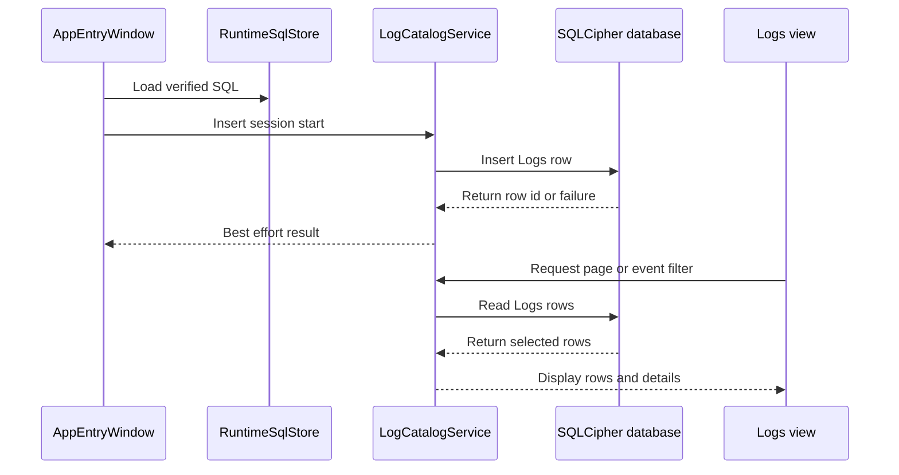
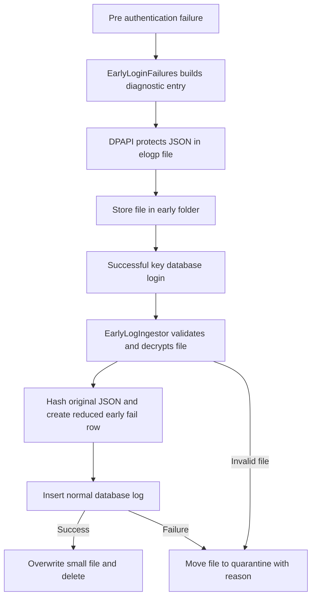
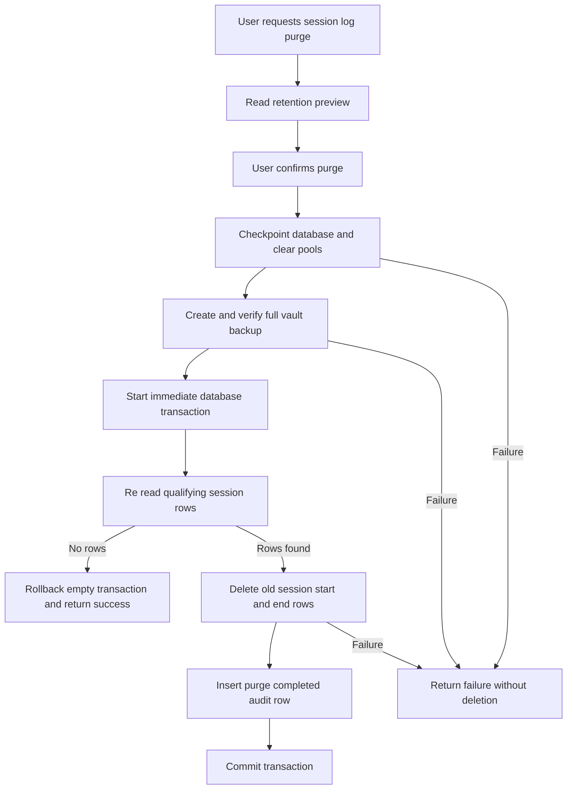

# MWPV Logging Lifecycle and Purge Flow

## Scope and current position

This record describes the logging implementation currently present in source. It covers authenticated database logging, pre authentication diagnostic files, viewing, retention and purge. It does not propose a replacement design.

The central privacy decision is implemented in `LogCatalogService`: the normal `Logs` table does **not** persist the richer early diagnostic payload. `RequestV3.Payload`, `PayloadFmt`, and `PayloadVer` remain compatibility properties, but `s_Logs_Insert.sql` has no matching columns or parameters. An early log is reduced to a normal `EARLY_FAIL` row with a source, event code, timestamps, and SHA 256 value in `StackHash`.

## Components and responsibilities

| Component | Owns | Must not do |
|---|---|---|
| `LogCatalogService` | Insert and read normal `Logs` rows through verified runtime SQL | Persist payload compatibility fields or make logging success a prerequisite for user work |
| `TemplateLogWriter` | Render non sensitive templates and best effort event inserts | Store raw vault secrets or JSON payloads |
| `EarlyLoginFailures` | Write DPAPI protected pre authentication files | Open the password database |
| `EarlyLogIngestor` | Post login decrypt, reduce, insert, delete or quarantine early files | Copy rich early JSON into normal database fields |
| `Logs` and `LogDetailsPanel` | Page, filter, display and clear visible log text | Retrieve a payload field that the schema does not store |
| `LogPurgeCoordinator` | Verified vault backup, retained session row deletion and audit insert | Purge arbitrary event types |
| `MainWindow` | User confirmation, exclusive maintenance state and status messages | Delete logs without coordinator backup verification |
| `SensitiveClipboardService` | Timed clipboard ownership and operational events about clipboard actions | Record copied value in its log message |

## Normal authenticated operational logging

Once `AppEntryWindow.btnSubmit_Click` has authenticated the key file, loaded runtime SQL, and can open the encrypted database, it calls `LogCatalogService.InsertSessionStart` best effort and sets `AppRunState.DbOpenedThisRun`. `App.OnExit`, plus the unhandled exception handlers, call `InsertSessionEnd` only when that flag is true and an end has not already been written.

`LogCatalogService.Insert` opens the SQLCipher database through `DatabaseHelper.GetAppOpenConnection`, retrieves `s_Logs_Insert.sql` from `RuntimeSqlStore`, binds fields, and returns the inserted ID or `-1`. It catches all exceptions; callers commonly use its result only for best effort logging.

Normal event sources currently include:

| Category | Source examples and event codes present |
|---|---|
| Session and login | `LOGIN` from `InsertLoginEvent` exists, though the reviewed entry flow calls `SESSION_START`; `SESSION_END` is written for normal exit and handled unhandled exceptions. |
| Early authentication | `EARLY_FAIL` from `EarlyLogIngestor` after successful authentication. |
| Category and item work | `CATEGORY_CREATED`, `CATEGORY_UPDATED`, and category item/account event constants in `CategoryService` and `CategoryItemEditorTabs`. |
| Settings | `APP_SETTING_UPDATED`, `APP_SETTING_RESET`, `APP_SETTING_RESET_ALL` from `AppSettingsPanel`. |
| Clipboard operations | Copy, clear, changed before clear, and failure codes from `SensitiveClipboardService`, such as `SensitiveClipboardCleared`. Messages record the action or exception type, not copied text. |
| Log maintenance | `LOG_PURGE_COMPLETED` written in the same transaction as a successful purge. |

The reviewed upgrade coordinator uses its separate best effort text `UpgradeLogger`; it is not shown to insert a normal `Logs` database event. Likewise, backup coordinators are not shown to insert a dedicated normal backup event except the purge audit record.

## Normal database schema and display

`MWPV/sql/MWPV_DB_Create.sql` defines `Logs`: `Id`, `WhenUtc`, `CreatedUtc`, `Level`, `Source`, `EventCode`, `SessionId`, `LoginId`, `ItemId`, `SubjectText`, `MessageText`, `MachineId`, `DeviceMake`, `DeviceModel`, `OSVersion`, `DeviceIdHash`, `InstallType`, `AppVersion`, `IsCrash`, `KeySetVersion`, and `StackHash`.

`s_Logs_Insert.sql` persists every one of those columns. `LogCatalogService` supplies the machine name and defaults `KeySetVersion` to 1. `WhenUtc` and `CreatedUtc` are ISO UTC text. Session helpers do not supply a session identifier, and no active session ID generation or correlation assignment was found in the reviewed write paths. `SessionId` is persisted as an empty string unless a caller supplies it. `LoginId` and `ItemId` are nullable.

`Payload`, `PayloadFmt`, and `PayloadVer` in `RequestV3` are deliberate no op compatibility fields. `EventCatalog.ElogV1` also models a legacy plaintext `.elog` format with optional session ID and dedupe data, but the active early writer writes `.elogp`; `EarlyLogIngestor` explicitly has no deduplication. The `Logs` table does not have payload columns.

`Logs.xaml.cs` pages 15 rows, newest `CreatedUtc` first. It loads filter values from `ComboDetail` type `log_filters`, defaults to `ALL` whenever the view opens, and otherwise filters on exact `EventCode` with a special `APP_SETTINGS` group. `LogDetailsPanel` rereads canonical metadata by ID but intentionally leaves the displayed message from the row and does not handle payload. It clears displayed text when hidden or unloaded. No log-view copy control was found. Fatal error popups have a separate direct clipboard copy helper, so diagnostic exception text can be copied outside the log view and is not managed by `SensitiveClipboardService`.

## Pre authentication and early diagnostic logging

`EarlyLoginFailures.Write` is the active pre authentication writer. It stores an `EarlyEntry` with UTC time, category, message, optional related file, exception type, exception message and exception stack. The writer serializes JSON, protects its UTF 8 bytes with current user DPAPI and header entropy, Base64 encodes it, and writes:

`<data root>\MWPV\early\yyyyMMdd HHmmssZ guid.elogp`

The first line is `ELOGJSON|1|dpapi`; the remaining line is Base64 ciphertext. `App.OnStartup` creates the `early` and `early\quarantine` folders but deliberately does not ingest before a successful key database login. Relevant early calls cover a second instance, listener startup or handler failures, entry key file failures, SQL catalog failure, and initial window failures. `EarlyLoginFailures.Write` catches all errors so diagnostic logging cannot block startup.

After successful entry authentication, `App.OnStartup` counts pending `.elogp` files, calls `EarlyLogIngestor.IngestAll`, and posts a status message based on the count observed before ingestion. It does not report an actual inserted count. `TryReadAndDecrypt` validates the header, Base64 decodes, DPAPI unprotects and deserializes. Ingestion hashes the original decrypted JSON, makes a structured DTO in memory, but passes that payload only to the compatibility fields of `RequestV3`. The resulting database row is `ERROR`, `EarlyIngest`, `EARLY_FAIL`, with original occurrence time as `WhenUtc`, ingestion time as `CreatedUtc`, and hash in `StackHash`. The raw category, related file, exception message and stack do not become normal persisted log columns through this path.

On a successful insert, the file is overwritten with zeros when it is not larger than one MiB and then deleted. Read, decrypt, empty payload, insert, or general ingestion failures move the file to `early\quarantine` and write a neighboring `.reason.txt` where possible. Quarantine reason text can include exception messages. `SensitiveDataCleaner` also has legacy residual `.elog` cleanup support, but no active `.elog` writer was found.

## Retention and purge

`AppSettingsService` uses `AS_LogRetentionDays`; its default is 30 days and validation minimum is 30. The setting controls only the explicit session log purge flow. It is not a general automatic retention job and does not delete arbitrary operational, error, settings, item, or clipboard rows.

`MainWindow.PurgeLogsAsync` retrieves a preview, shows the retention days, UTC cutoff rendered locally, and counts of qualifying start and end rows, then requires explicit OK. `RunExclusiveLogPurgeAsync` disables the UI, shows a maintenance overlay, suspends sensitive clipboard database activity, and suppresses background database activity until the operation completes.

`LogPurgeCoordinator.PurgeAsync` calculates `cutoff = purgeStartedUtc - retention days`. It first requires a full WAL checkpoint, clears connection pools, obtains the selected key file from SEDS, and creates a `Manual` verified full vault backup in `<data root>\MWPV\log-purge-backups` with prefix `LogPurge_Backup`. The backup input comes from `BackupOnExitCoordinator.BuildVaultFiles`, so it includes the application database, applicable SQLite sidecars, and matching key file. It verifies the published backup before deletion.

Inside a non deferred transaction with a ten second busy timeout, it re-reads the preview, deletes only `SESSION_START` and `SESSION_END` rows where `julianday(WhenUtc) < julianday(cutoff)`, checks the deleted row count equals the transactional preview, writes `LOG_PURGE_COMPLETED`, and commits. Login rows and all other event codes are protected because the delete SQL does not select them. Rows exactly at the cutoff are retained. If the transactional preview is zero, it rolls back the empty transaction but still returns success with the verified backup ID. `MainWindow` therefore shows its no rows message even though a backup was already created.

## Failure matrix

| Condition | Handling | User visible effect | Data handling |
|---|---|---|---|
| Normal insert/open/runtime SQL failure | `LogCatalogService.Insert` catches and returns `-1` | Usually none because callers are best effort | No payload is bound to the SQL insert. |
| Session end on shutdown/crash fails | `App` catches and continues shutdown | None | End marker may be absent. |
| Early file creation fails | Writer swallows exception | None | Startup continues without an early diagnostic record. |
| Early header, Base64, DPAPI or JSON failure | Ingestor quarantines file | No modal; pending status can overstate successful ingestion | Protected original is retained in quarantine with reason file where possible. |
| Early database insert fails | Ingestor quarantines file | No modal | Rich early file is not copied to `Logs`. |
| Secure delete fails | Final `File.Delete` is attempted | None | File may remain until another handling path. |
| Logs page/details read fails | Service returns empty/null; UI may show error for non silent load | List can appear empty or details unavailable | Details UI clears on hide/unload. |
| Checkpoint, backup, verification, transaction or audit insert fails | Purge returns failure; transaction catches and does not commit | Warning status says no logs deleted | Backup may already exist when later purge step fails. |
| Purge count changes | Throws before audit/commit | Same failure status | Transaction disposal rolls back deletion. |

## Sensitive lifecycle, trust boundaries, and limitations

| Data | Source and lifetime | Protection and minimization | Owner and limitation |
|---|---|---|---|
| Normal row fields | Authenticated services to encrypted application DB | SQLCipher at rest; no payload columns | Callers must avoid secrets in subject/message tokens. Templates can render user supplied names and other non secret context. |
| Early diagnostics | Pre auth failure through successful ingest or quarantine | Current user DPAPI while stored in `.elogp` | `EarlyLoginFailures` and ingestor. Decrypted JSON and exception strings exist in memory during parse. |
| Early rich fields | Category, related file, exception details and stack | Hash only is persisted as `StackHash` in normal log | Ingestor intentionally does not promote raw details. Quarantine retains original protected file and reason text. |
| Clipboard value | User data copied to Windows clipboard for configured TTL | Clipboard service owns and clears matching content | Clipboard event logs omit the value. Other fatal popup copy bypasses the service and can copy diagnostic detail. |
| Purge backup | Encrypted DB, sidecars and key file before purge | Backup utility verification before deletion | Retained without a purge specific retention cleanup shown in this flow. |

Trust boundaries are deliberate: pre authentication code may write only DPAPI protected diagnostic files, not database logs; normal logging may insert only through authenticated SQLCipher access and verified runtime SQL; the ingestor may reduce early diagnostics but must not persist its payload compatibility data; purge may delete only the two session event codes after backup verification; UI status and logging must not turn a logging failure into a vault operation failure.

Known source realities:

- `EarlyLogIngestor` comments still say payload is stored as UTF 8 JSON, but the current `LogCatalogService` deliberately ignores payload fields. That comment is stale; the code implements reduction instead.
- `EventCatalog.ElogV1` and `Services/EarlyLogEntryV1.cs` describe legacy plaintext `.elog` behavior. The active writer is `.elogp` and the active ingestor has no dedupe.
- `InsertSessionEnd` accepts reason, error state, and exit code but does not persist any of them in the current request it creates. It does not copy the reason into message text or set `IsCrash` from the error argument.
- No active session ID generator or assignment was found, so existing session rows are not correlated through `SessionId` by the reviewed paths.
- Purge has a success message in `MainWindow`; however, it can create and retain a verified backup even if recheck finds zero rows, then report no rows without mentioning that backup.
- Log service read catches are intentionally quiet, so an empty view can represent no rows or a read failure. Normal log insert also discards exception detail.

## Source reference index

Primary implementation: `MWPV/App.xaml.cs`; `MWPV/Services/LogCatalogService.cs`; `MWPV/Services/TemplateLogWriter.cs`; `MWPV/Utilities/Diagnostics/EarlyLoginFailures.cs`; `MWPV/Utilities/Diagnostics/EarlyLogIngestor.cs`; `MWPV/Services/LogPurgeCoordinator.cs`; `MWPV/MainWindow.xaml.cs`; `MWPV/View/UserControls/Logs.xaml.cs`; `MWPV/View/UserControls/Logs/LogDetailsPanel.xaml.cs`; `MWPV/Services/Security/SensitiveClipboardService.cs`; `MWPV/View/UserControls/AppSettingsPanel.xaml.cs`.

Relevant SQL: `MWPV/sql/MWPV_DB_Create.sql`, `s_Logs_Insert.sql`, `s_Logs_SelectPage.sql`, `s_Logs_SelectPageFilter.sql`, `s_Logs_SelectById.sql`, `s_Logs_PurgeSessionPreview.sql`, and `s_Logs_PurgeSessionDelete.sql`.
