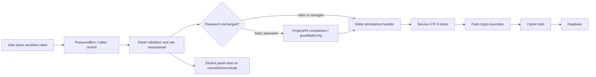
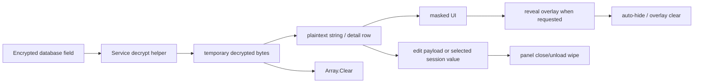
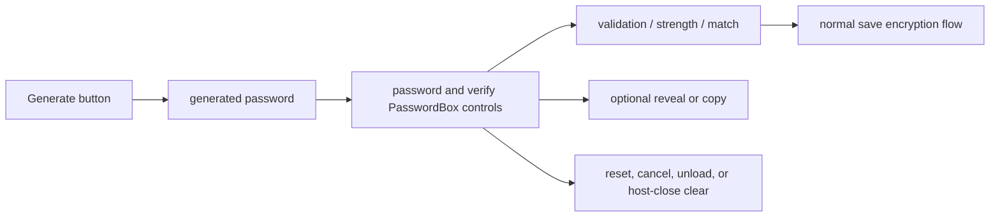
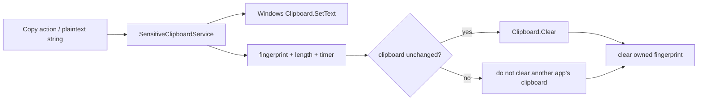
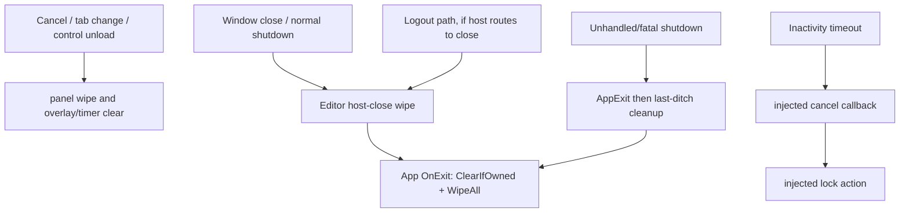

# MWPV Sensitive Data in Memory Flow

## Scope and evidence

This document describes the sensitive-data lifecycle implemented by the MWPV application layer as reviewed on 2026-07-17. It deliberately does not describe the internal implementation of `Security.Utility`; that library is treated as a boundary. It complements, rather than repeats, [the high-level flow](MWPV_High_Level_Flow.md) and [component/trust-boundary document](MWPV_Component_Responsibilities_and_Trust_Boundaries.md).

Repository-relative source references below identify the observed implementation. “Wipe” means the explicit clear operation named in the source; it is not a claim of forensic or runtime-guaranteed erasure.

## Data domains and entry points

Plaintext first enters MWPV at WPF controls: `PasswordBox` / `SecurePassword` during entry and login, and `PasswordBox`/text controls used by the basic, bank-card, account, and security-question editors. Examples include the entry dialog converting `SecurePassword` to `char[]` (`MWPV/Utilities/Security/AppEntryWindow.xaml.cs:318-391`) and editor controls reading `.Password` into `string` values (for example `MWPV/View/UserControls/CategoryItems/CategoryItemAccountsPanel.xaml.cs:688-733`). Existing database values first become plaintext when the application services decrypt field blobs to UTF-8 strings (`MWPV/Services/CategoryItemAccountsService.cs:593-639`; `MWPV/Services/CategoryItemSecurityQuestionsService.cs:468-514`).

Sensitive domains are distinct:

| Domain | What it holds | Owner / boundary |
| --- | --- | --- |
| UI/control memory | `PasswordBox` content, reveal `TextBox` content, editor row DTO raw values, validation strings | WPF controls and editor panels |
| Application/service memory | local strings, `char[]`, UTF-8/decrypted byte arrays, persistence payloads and fingerprints | MWPV panels/services |
| Session-held secrets | login/key material and selected protected values stored under keys | `SecureEncryptedDataStore` boundary |
| Clipboard memory | copied plaintext plus MWPV ownership fingerprint | Windows Clipboard / `SensitiveClipboardService` |
| Database storage | encrypted field blobs sent to SQL | database boundary |
| Logs/diagnostics | event/reason/status data, exception type | logging boundary; not intended to receive plaintext |

## New and edited values: validate, compare, encrypt, persist

The UI panels keep raw values long enough to validate an entry, render masked data, form a commit payload, and hand it to `CategoryItemEditorTabs`. Their save events carry raw rows (`MWPV/View/UserControls/CategoryItems/CategoryItemBankCardsPanel.xaml.cs:12,39,1408-1411`; analogous accounts and questions handlers are wired in `MWPV/View/UserControls/CategoryItemEditorTabs.xaml.cs:2059-2089`). This is necessary because encryption occurs in the persistence services, not in the individual controls.

Services encode plaintext to temporary UTF-8 bytes, call the field crypto boundary, and clear their temporary input and ciphertext byte buffers in `finally` paths (`MWPV/Services/CategoryItemAccountsService.cs:288-305,375-392,593-609`; `MWPV/Services/CategoryItemSecurityQuestionsService.cs:218-238,296-317,468-484`). The resulting cipher blobs—not application plaintext—are passed to database operations.

For basic-password history/change handling, the editor captures signatures in session storage and uses `PasswordFingerprintComparer` to compare a submitted plaintext value with the original fingerprint without retaining a second plaintext baseline (`MWPV/View/UserControls/CategoryItemEditorTabs.xaml.cs:623-640,669-701`; `MWPV/Utilities/Security/PasswordFingerprintComparer.cs:28-68`). An `Unchanged` comparison prevents treating a legacy/unchanged value as a new password; the code documents this compatibility/grandfathering behavior. The comparison still necessarily receives the submitted `string` and creates a temporary fingerprint byte array, which it clears.



## Existing values: decrypt, mask, reveal, edit, clear

The account and security-question services decrypt database blobs so they can build detail/row data and masks (`MWPV/Services/CategoryItemAccountsService.cs:75-98,134-236`; `MWPV/Services/CategoryItemSecurityQuestionsService.cs:62-71,140-146`). Each decrypt helper converts temporary decrypted bytes to a `string` and clears the byte array (`MWPV/Services/CategoryItemAccountsService.cs:613-639`; `MWPV/Services/CategoryItemSecurityQuestionsService.cs:488-514`). The plaintext string is then still present wherever the service returns it, or wherever a panel keeps it for editing, selection, copy, or a save payload.

Panels normally display masked fields. Reveal copies the current protected-control value to a read-only plain `TextBox`; an auto-hide timer restores masking and clears that overlay (`MWPV/View/UserControls/CategoryItems/CategoryItemAccountsPanel.xaml.cs:485-505,686-713`). Bank-card and basic panels use the same pattern and clear reveal overlays during their wipe paths (`MWPV/View/UserControls/CategoryItems/CategoryItemBankCardsPanel.xaml.cs:189-197,1678`; `MWPV/View/UserControls/CategoryItems/CategoryItemBasicPanel.xaml.cs:1976-1983`). Masking prevents casual display, but it does not remove the underlying protected control or row’s raw value.



## Generated passwords

The basic editor generates a password into the password/verification controls, then ordinary password-change handling, validation, reveal/copy, and save apply (`MWPV/View/UserControls/CategoryItems/CategoryItemBasicPanel.xaml.cs:2037-2063` wires `BtnGeneratePassword_Click`; password/verification validation is visible at `:1477-1481`). The generated value therefore exists in the generator result, the WPF password control(s), any reveal overlay, and local strings used by validation/copy until reset, save/cancel, panel unload, or host close triggers the panel wipe. This review did not find a separate durable “generated password” store.



## Sensitive clipboard handling

Copy handlers call `ClipboardHelper.TryCopySensitiveText`, which delegates to the singleton `SensitiveClipboardService` (`MWPV/Utilities/Helpers/ClipboardHelper.cs:7-31`). The service sets Windows Clipboard text, retains only a SHA-256-style ownership fingerprint and length, and starts a configurable timer (`MWPV/Services/Security/SensitiveClipboardService.cs:34-66,293-318`). On expiry it reads current clipboard text, compares fingerprint/length in fixed time, clears the clipboard only if it still owns that value, then clears its fingerprint buffer (`:99-154,282-286`). Explicit/app-shutdown cleanup calls `ClearIfOwned` (`MWPV/Utilities/Helpers/ClipboardHelper.cs:38-44`; `MWPV/App.xaml.cs:455-475`). If another application replaced clipboard content, MWPV intentionally does not erase it.



## Session-held values and the SecureEncryptedDataStore boundary

MWPV uses `SecureEncryptedDataStore` (SEDS) for login/key material and selected protected details, but this document makes no claim about its internal representation. The entry window stores the validated key-file password with `SetAndWipe`, stores/generated DB password material, and clears local `char[]` buffers (`MWPV/Utilities/Security/AppEntryWindow.xaml.cs:318-391,482-497`). Editors put selected account/card values in SEDS and retrieve bytes for copy/display; retrieved arrays are cleared after conversion (`MWPV/View/UserControls/CategoryItems/CategoryItemAccountsPanel.xaml.cs:1006-1034`; `MWPV/View/UserControls/CategoryItems/CategoryItemBankCardsPanel.xaml.cs:1199-1226`). The selected-value keys are explicitly cleared on reload/auto-commit/host-close. `SensitiveDataCleaner.WipeAll()` is invoked during application shutdown (`MWPV/App.xaml.cs:455-475`) and crosses the SEDS boundary, but its internal guarantee is out of scope here.

```mermaid
flowchart LR
  A[Panel/login char[] or string] --> B[SEDS Set / SetAndWipe]
  B --> C[secure in-memory store boundary]
  C --> D[TryGetBytes for copy/display/crypto]
  D --> E[temporary byte[] and string]
  E --> F[Array.Clear temporary bytes]
  E --> G[useful operation completes]
  G --> H[SEDS Clear selected key or WipeAll at shutdown]
```

## Cleanup paths

Panels subscribe to `Unloaded` and stop reveal timers, clear overlays, and wipe entry fields; full row wipes occur when host-close was requested (`MWPV/View/UserControls/CategoryItems/CategoryItemAccountsPanel.xaml.cs:342-353`; bank-card equivalent `:354-360`). `CategoryItemEditorTabs.WipeAllForHostClose` invokes the basic, card, account, and question panel wipes (`MWPV/View/UserControls/CategoryItemEditorTabs.xaml.cs:1284-1303,1339-1355`). Its cancel path calls this wipe before raising `Canceled` (`:2338-2342`); tab-leave paths invoke `TryAutoCommitAndWipe` (`:2464-2467,2533-2536`).

At the app level, normal exit runs the sensitive shutdown routine, which clears an owned clipboard value and calls `SensitiveDataCleaner.WipeAll`; fatal shutdown has a final best-effort call as well (`MWPV/App.xaml.cs:247-290,431-475`). `InactivityLockService` calls an injected cancel callback before its injected lock action (`MWPV/Services/InactivityLockService.cs:1-10,135-148`), so whether every open editor is wiped on inactivity depends on the callback installed by its host. The inspected code establishes the service contract but does not itself name the editor wipe method. Login-window cancellation/closing clears its controls (`MWPV/Utilities/Security/AppEntryWindow.xaml.cs:413-418,492-538`).



## Component responsibility

| Component / class | Sensitive data handled | Plaintext exposure | Cleanup responsibility | Next boundary |
| --- | --- | --- | --- | --- |
| `AppEntryWindow` | key-file password, generated DB password | `SecurePassword`, temporary `char[]`, controls | clear arrays and controls on completion/close | SEDS, key-file/database validation |
| `CategoryItemBasicPanel` | passwords, PIN, email, phone, primary account | protected controls, reveal text, local strings | hide/clear overlays and `WipeAllForHostClose` | editor persistence / clipboard |
| Account/Card/Question panels | account/card numbers, CVV/PIN, ZIP, questions/answers | raw DTOs, protected controls, overlays, selected SEDS values | unload, cancel, auto-commit, host-close wipe | editor handlers and SEDS |
| `CategoryItemEditorTabs` | commit payloads, password signatures | local plaintext submitted for comparison | coordinates all panel wipes and clears signature SEDS keys | services |
| field persistence services | field plaintext, UTF-8 and cipher bytes | local strings and byte arrays during transform | clear temporary byte/cipher arrays | encrypted database storage |
| `SensitiveClipboardService` | copied plaintext, ownership fingerprint | Windows Clipboard text; local read string | TTL/explicit/shutdown owned clear; zero fingerprint bytes | Windows Clipboard |
| `SecureEncryptedDataStore` | login/key/session selected values | boundary; internals not reviewed here | per-key `Clear` and global `WipeAll` are requested by MWPV | in-memory security boundary |

## Sensitive-data lifetime

| Data type | Creation/decryption point | Representation | Expected lifetime | Cleanup | Limitation / residual risk |
| --- | --- | --- | --- | --- |
| User input | WPF entry/editor control | WPF internal state, `SecureString`/`PasswordBox` and strings | typing through save/cancel/close | `UICleaner.Clear`, control reset | WPF/framework copies are not controlled by MWPV |
| Decrypted field | service decrypt helper | `byte[]`, immutable `string`, DTO/control | display/edit/select operation | clear byte array; panel wipe | cannot overwrite immutable strings or all bound/UI copies |
| Generated password | generator to controls | generated result, `PasswordBox`, optional overlay | until save/reset/cancel/close | control/overlay wipe | any string copies remain GC-managed |
| Fingerprint | comparer/signature creation | `byte[]`, Base64 string for SEDS signature | comparison/session signature lifetime | `SensitiveDataCleaner.Zero`, SEDS clear | Base64 and source strings are immutable managed objects |
| Clipboard value | copy handler | Windows Clipboard string | configured TTL or explicit/shutdown clear | `ClearIfOwned` | other process, history, clipboard manager, or changed content is outside MWPV control |
| Temporary crypto buffers | UTF-8/encrypt/decrypt helper | `byte[]` | one crypto operation | `Array.Clear` in `finally` | native/runtime/provider buffers not established by this review |
| SEDS secret | login/selection set call | security-library-managed storage | until per-key clear or app wipe | `Clear`, `WipeAll` request | internals are explicitly outside this document |

## Logs and diagnostics

The inspected clipboard service logs normalized event/reason codes and exception type, not the copied text (`MWPV/Services/Security/SensitiveClipboardService.cs:349-377`). Field services route crypto failures through `LogSecurityUtilityResult` rather than logging the plaintext input (`MWPV/Services/CategoryItemAccountsService.cs:620-628`; `MWPV/Services/CategoryItemSecurityQuestionsService.cs:495-503`). The entry window logs outcome/result descriptions for invalid key/password processing (`MWPV/Utilities/Security/AppEntryWindow.xaml.cs:377-385`) rather than the entered password. This supports the conclusion that sensitive values are not intentionally written to normal logs in the reviewed paths.

This is not a proof that no secret can reach a log: exception messages, third-party/provider behavior, future call sites, debugger dumps, and OS diagnostics are outside these safeguards. Callers should continue to avoid interpolating plaintext into log messages.

## Security Boundaries and Honest Limitations

MWPV explicitly clears mutable `char[]`/`byte[]` values where shown, resets controls/overlays, clears selected SEDS keys, clears an owned clipboard item, and requests global cleanup on shutdown. These actions end the application’s useful lifetime for those values; they do **not** guarantee physical memory erasure.

In particular, .NET `string` is immutable and may have multiple copies from trimming, formatting, bindings, UTF-8 conversion, reveal overlays, and clipboard APIs. WPF controls and `SecureString` implementation details are framework-owned. The garbage collector determines reclamation timing and can move objects; MWPV cannot reliably overwrite all managed copies. Database/crypto-provider/native buffers, Windows Clipboard history, clipboard managers, screen capture, crash dumps, paging, debuggers, and another process’s clipboard replacement are outside the application’s cleanup guarantee.

The session-store and `Security.Utility` internals are not asserted here. This document only records MWPV’s calls into that boundary (`SetAndWipe`, `SetString`, `TryGetBytes`, `Clear`, and `WipeAll`).

## Review findings and uncertainties

* The comments in account/card panel files describe row DTOs as containing raw values (`MWPV/View/UserControls/CategoryItems/CategoryItemAccountsPanel.xaml.cs:8-11`; `MWPV/View/UserControls/CategoryItems/CategoryItemBankCardsPanel.xaml.cs:9-12`). They are intentionally needed for editing/persistence but increase in-memory exposure until the host-close/row wipe runs.
* The exact host wiring for `InactivityLockService` was not located in the inspected source set. The service promises to invoke injected cancel then lock callbacks, but whether that cancel callback always invokes each editor’s full wipe is therefore unverifiable from the service alone.
* “Logout” is not a distinct sensitive-cleanup method in the inspected results. The document describes the observed close/shutdown cleanup and treats a logout as protected only when it routes through those host-close/app-exit paths. This is a documentation/security review item, not a claim that logout is unsafe.
* Existing high-level/trust-boundary documents provide architectural context; this file intentionally concentrates on transient plaintext, control state, copy, and cleanup rather than duplicating their wider system descriptions.
