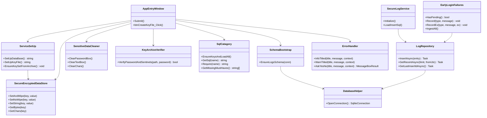

# MWPV — Security & Logging

## 1) Class Diagram



---

## 2) Startup / Security Flow

```mermaid
flowchart TD
    A[App Start\n(App.xaml.cs)] --> B[AppEntryWindow]
    B -->|First Run| C[ServiceSetUp\nCreate DB + Key Archive]
    B -->|Existing Install| D[KeyArchiveVerifier\nVerify password + sentinels]

    C --> E[SecureEncryptedDataStore\nStore DB_Password + KeyPW]
    D --> E

    E --> F[SqlCatagory\nEnsureKeysAndLoadAll()]
    F --> G[SchemaBootstrap\nEnsure Logs schema]
    G --> H[DatabaseHelper\nOpenConnection()]

    H --> I[SecureLogService\nInitialize + load INSERT SQL]
    I --> J[LogRepository\nInsert / Select / LastId ready]

    %% Early logs and cleanup
    B --> K[EarlyLoginFailures\n(.elog on errors)]
    K -->|On next good login| J
```
