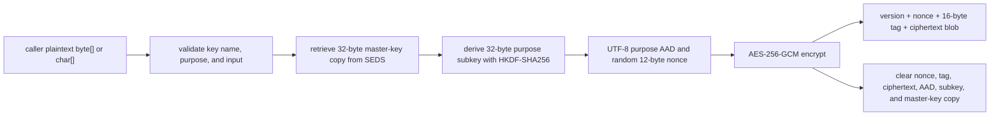
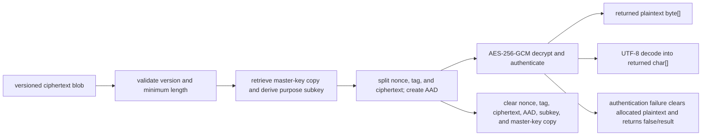
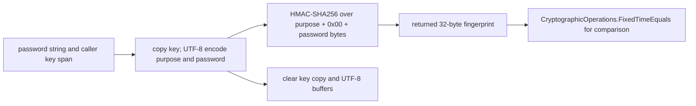
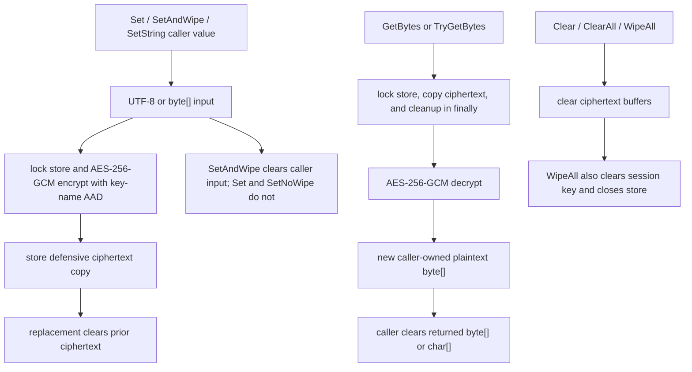
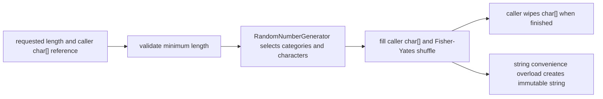
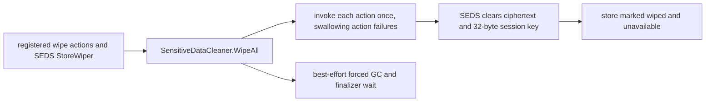

# Security.Utility Data Flow and Cryptographic Boundaries

## Scope and evidence

This document records source-verified behavior in `Security.Utility`, reviewed on 2026-07-17. It covers its cryptographic transformations, secure in-memory store, temporary buffers, results, and wiping. It does not describe MWPV forms or application lifecycle; those are covered by [MWPV Sensitive Data in Memory Flow](MWPV_Sensitive_Data_In_Memory_Flow.md), [high-level flow](MWPV_High_Level_Flow.md), and [component/trust-boundary document](MWPV_Component_Responsibilities_and_Trust_Boundaries.md).

“Wipe” below means the explicit `Array.Clear`, `SecureString.Clear`, removal, or disposal visible in source. It is not a claim of physical-memory erasure.

## Security-facing public API inventory

| Class | Public API group | Purpose and sensitive inputs | Returned value | Temporary allocations / cleanup | Caller obligation |
| --- | --- | --- | --- | --- | --- |
| `FieldAesCrypto` | `EncryptBytes`, `EncryptCharsAndWipe` | AES-GCM encrypts plaintext `byte[]` or UTF-8 encoded `char[]`; master key is retrieved from SEDS | versioned ciphertext blob | master/subkey, AAD, nonce, tag, ciphertext cleared; `EncryptCharsAndWipe` clears its input | retain/protect ciphertext as appropriate; do not reuse wiped char input |
| `FieldAesCrypto` | `TryDecryptBytes`, `TryDecryptChars` and `...Result` variants | decrypts authenticated blob using SEDS master key and purpose | plaintext `byte[]`/`char[]`, or Boolean/result code | key, subkey, AAD, nonce, tag, ciphertext cleared; failed plaintext cleared | clear returned plaintext buffers promptly |
| `DpapiDbPayloadCrypto` | `ProtectPasswordHistory`, `TryUnprotectPasswordHistory` | CurrentUser DPAPI protection for password-history string and ciphertext input | ciphertext/signature, or plaintext `string` | UTF-8 plaintext and entropy cleared; DPAPI output/plaintext string cannot be wiped | use only for non-portable machine/user-bound data; do not retain/log returned string |
| `SensitiveValueSignature` | `Compute`, `FixedTimeEquals` | HMAC-SHA256 fingerprint of plaintext string and caller key; fixed-time fingerprint comparison | 32-byte fingerprint / Boolean | key copy and UTF-8 temporary buffers cleared | keep and clear fingerprint and key buffers; do not treat fingerprint as plaintext |
| `Sha256Common` | `Bytes`, `Hex`, `ShortHex`, file/stream and `Try...File` overloads | unkeyed SHA-256 over strings, arrays, spans, streams, or files | 32-byte digest, lowercase hex, short hex, or Boolean | string-derived UTF-8 buffers and the full rented hex-character buffer are cleared in `finally` | decide whether input/digest is sensitive; clear caller-owned arrays and avoid logging digest identifiers without policy |
| `SecurePassword` | policy validators; `Generate`, `GenerateCompatible`, `GenerateAlphanumeric`; string-returning variants | validates strings or generates random password into `char[]`/`string` | Boolean/result, generated `char[]` through `ref`, or immutable string | result strings cannot be wiped; internal character-set arrays are not secret | wipe generated `char[]`; avoid string-returning variants for secrets that need best-effort wiping |
| `SecureEncryptedDataStore` | `Set`, `SetAndWipe`, `SetNoWipe`, `SetString`, `SetInt32` | stores values under a logical key using a process session key | none | UTF-8 and construction buffers cleared; replacement ciphertext is cleared | choose wiping setter; `Set`/`SetNoWipe` leave caller input under caller control |
| `SecureEncryptedDataStore` | `GetBytes`, `TryGetBytes`, `GetChars`, `GetString`, `GetInt32` and result/Try variants | retrieves and decrypts an entry | copied plaintext value, Boolean, or result code | conversion buffers cleared where visible | immediately clear returned `byte[]`/`char[]`; do not use `GetString` for secrets needing wipe |
| `SecureEncryptedDataStore` | `Clear`, `ClearContext`, `ClearAll`, `WipeAll`, `HasKey`, `Keys` | removes entries or globally ends store lifetime | none / metadata | ciphertext and session key cleared by clear/wipe | clear per-key values when no longer needed; global wipe permanently closes the store |
| `KeysetJsonBuilder` / `KeysetJsonV2` / `KeyProvisioner` | build, deserialize, validate, decode keyset APIs | keyset password chars, keys, base64 secret data, JSON bytes | JSON string, POCO, chars, Boolean/result | selected byte/chars cleared; serialized/deserialized secret strings cannot be wiped | protect returned JSON/POCO/char buffers and clear decoded chars |
| `SensitiveDataCleaner` / `SensitiveCollectionWiper` | registration, `WipeAll`, zero/clear helpers, collection wipe helpers | registered wipe actions and mutable buffers | none, counts, or result | invokes registered actions once; mutable buffers cleared best effort | register long-lived holders; callers own non-registered values and debug callbacks |
| `SensitiveDataCleaner` | secure-delete helpers | file paths and file contents | Boolean, counts, or result | overwrite buffer is GC-managed after use | treat filesystem overwrite as best effort; do not infer SSD/backup erasure |

`EmailValidator`, `JsonCore`, logging enums, and simple keyset POCO properties are public but do not themselves transform or retain cryptographic secret material. They are not expanded as cryptographic APIs.

## Cryptographic primitive summary

| Operation | Primitive and parameters | Randomness / encoding | Integrity behavior | Location |
| --- | --- | --- | --- | --- |
| Portable field encryption | AES-256-GCM; 12-byte nonce; 16-byte tag; blob `[version][nonce][tag][ciphertext]` | `RandomNumberGenerator.GetBytes(12)`; purpose encoded UTF-8 | GCM authenticates ciphertext and purpose as AAD | `Security.Utility/Crypto/FieldAesCrypto.cs:36-95,319-424` |
| Field key derivation | HKDF-style extract/expand with HMAC-SHA256; zero 32-byte salt; 32-byte output | UTF-8 `domain|purpose` info | per-purpose key separation, not authentication by itself | `Security.Utility/Crypto/FieldAesCrypto.cs:373-424` |
| Session store encryption | AES-256-GCM; 12-byte nonce; 16-byte tag; layout `[nonce][tag][ciphertext]` | session key and nonce from `RandomNumberGenerator`; key name UTF-8 AAD | GCM plus key-name binding prevents entry swap under a different name | `Security.Utility/Storage/SecureEncryptedDataStore.cs:35-59,464-524` |
| Machine-bound history protection | Windows DPAPI `ProtectedData` with `CurrentUser`; fixed entropy label | UTF-8 plaintext and non-secret entropy label | DPAPI protection; SHA-256 ciphertext signature is described as drift/integrity check, not an authenticated portable format | `Security.Utility/Crypto/DbPayloadCrypto.cs:40-170` |
| Fingerprint | HMAC-SHA256 over `purpose || 0x00 || UTF8(password)`; 32 bytes | UTF-8 purpose/password; caller-provided key | `CryptographicOperations.FixedTimeEquals` is available for comparison | `Security.Utility/Crypto/Signatures/SensitiveValueSignature.cs:40-95` |
| General hash | SHA-256, raw 32-byte digest or lowercase hex/short hex | optional encoding, stream/file input | unkeyed digest only; no secret-key authentication | `Security.Utility/Crypto/Hashing/Sha256Common.cs:22-225` |
| Password generation | `RandomNumberGenerator.GetInt32`; Fisher-Yates shuffle | random category selection and characters | no authentication function | `Security.Utility/Storage/SecurePassword.cs:108-234` |

## Field encryption and decryption

`FieldAesCrypto` obtains a 32-byte master key by calling `SecureEncryptedDataStore.TryGetBytes`. It rejects missing and non-32-byte keys; the exception-oriented APIs can include the logical SEDS key name in exception text, but do not include key bytes or plaintext (`Security.Utility/Crypto/FieldAesCrypto.cs:289-317`). A caller must use the identical purpose string for encrypt and decrypt.

`EncryptBytes` leaves its caller-owned plaintext untouched. `EncryptCharsAndWipe` UTF-8 encodes the caller `char[]`, invokes the byte API, and clears both the encoded bytes and the caller array in `finally` (`Security.Utility/Crypto/FieldAesCrypto.cs:194-208`).

Null or empty field blobs are an intentional valid “no value stored” state and return an empty buffer. A non-empty short or wrong-version blob is malformed. The Boolean methods return `false` for malformed/authentication failure; result methods return sanitized codes such as `ProtectedDataMalformed` or `ProtectedDataDecryptFailed` (`Security.Utility/Crypto/FieldAesCrypto.cs:102-188,215-283`). Returned plaintext arrays are caller-owned and must be cleared.

## Fingerprints and comparisons

Fingerprints are stable equality tokens, not encrypted password history. `Compute` copies the supplied span key because `HMACSHA256` requires `byte[]`, UTF-8 encodes purpose and password, feeds the three components separately, returns a 32-byte HMAC copy, and clears the key copy and UTF-8 buffers (`Security.Utility/Crypto/Signatures/SensitiveValueSignature.cs:44-87`). The original password `string` and returned fingerprint remain managed objects under caller ownership.

## SecureEncryptedDataStore

SEDS is a static, process-local dictionary of ciphertext entries. Its static constructor creates one random 32-byte AES session key and registers `WipeAll` with `SensitiveDataCleaner` (`Security.Utility/Storage/SecureEncryptedDataStore.cs:35-59`). Entry ciphertext is stored as nonce, tag, and ciphertext; the logical key name is UTF-8 AAD. The key name is metadata, not a secret by design, but it binds each encrypted value to its slot.

All dictionary/key operations use `_gate`. Encryption and decryption occur under that lock, preventing `WipeAll` from clearing the session key mid-operation. Replacing a key clears the old ciphertext buffer before replacing it; `Clear` clears and removes one entry; `ClearAll` clears every entry but leaves the store usable; `WipeAll` clears all entries and the session key, sets `_wiped`, and thereafter regular operations throw or result with `SecureStoreUnavailable` (`Security.Utility/Storage/SecureEncryptedDataStore.cs:167-194,366-459`). There is no reinitialization API after global wipe.

`GetBytes`/`TryGetBytes` return newly decrypted plaintext arrays, not the store’s ciphertext array. Their copied ciphertext is now cleared in `finally`; the private decrypt helper clears its AAD, nonce, tag, ciphertext, and any unsuccessful plaintext allocation in `finally`, while transferring only successful plaintext to the caller. `GetChars` clears its intermediate plaintext byte array after UTF-8 decode; `GetString` does likewise but returns an immutable string, documented for non-sensitive data (`Security.Utility/Storage/SecureEncryptedDataStore.cs:200-359,506-548`). Callers must clear returned bytes/chars. `Keys()` returns logical key-name metadata; it does not expose values.

## Password generation, hashing, keysets, and DPAPI

`SecurePassword` generates into a caller-selected/replaced `char[]`; the caller owns its lifetime. All generators require length at least eight. General and compatible modes select three of four categories and shuffle; alphanumeric mode includes lower, upper, and digit. The string convenience methods clear their temporary `char[]` but necessarily return an immutable password string (`Security.Utility/Storage/SecurePassword.cs:108-234`). Policy APIs accept immutable strings and report either a user-facing validation message or a sanitized result code.

`Sha256Common` is an unkeyed general hash helper, not a password-hashing/KDF facility. Its string overloads now clear their internally encoded UTF-8 `byte[]` in `finally`, and `ToHex` clears the entire rented `char[]` before returning it to `ArrayPool`. Raw digests can be cleared by callers; returned hex is immutable. File/stream APIs read from the current stream position and, unless `leaveOpen` is true, dispose the stream (`Security.Utility/Crypto/Hashing/Sha256Common.cs:22-270`).

Keyset v2 represents the DB password as base64 of UTF-8, explicitly relying on archive encryption rather than adding cryptography. `BuildV2` clears its temporary password bytes but returns secret-bearing JSON; `DecodeDbPasswordToChars` clears decoded bytes and returns caller-owned characters. `ValidateKeysetJsonResult` clears supplied JSON bytes and decoded password/key buffers on its visible paths, but JSON deserialization creates immutable secret-bearing strings/objects (`Security.Utility/Crypto/KeysetJsonBuilder.cs:16-59`; `Security.Utility/Crypto/KeysetV2.cs:36-89`; `Security.Utility/Crypto/KeyProvisioner.cs:20-134`).

`DpapiDbPayloadCrypto` is deliberately Windows/current-user bound. It must not protect portable vault data: copied data cannot be decrypted under another Windows profile or machine. It clears UTF-8 plaintext and entropy buffers, but its decrypt method returns an immutable password string (`Security.Utility/Crypto/DbPayloadCrypto.cs:5-28,79-170`).

## Wiping, disposal, result codes, logging, and errors

`SensitiveDataCleaner.Register` retains wipe actions until `WipeAll`. `WipeAll` is idempotent, takes each action from a concurrent bag, swallows action failures, then forces collection/compaction as a residual-reduction attempt (`Security.Utility/Wiping/SensitiveDataCleaner.cs:33-81`). SEDS registers itself there. The cleaner also has direct array/character/`SecureString` clear methods. No public `IDisposable` instance represents the static SEDS lifecycle; `WipeAll` is its terminal disposal equivalent.

Result APIs return `SecurityUtilityResult` containing a code and seriousness only; their documented contract excludes plaintext, keys, paths, raw exception text, and caller actions (`Security.Utility/SecurityUtilityResult.cs:3-49`). Codes cover invalid input, store/key state, protected-data failure, keyset validation, policy failure, wipe/delete failure, and unknown failure (`Security.Utility/SecurityUtilityReturnCode.cs:15-80`). Other APIs intentionally throw standard validation, missing-key, crypto, JSON, or I/O exceptions. Callers should prefer result wrappers where they need a loggable technical outcome and must not log raw exceptions from sensitive contexts without review.

No inspected source intentionally logs keys, plaintext, decrypted values, generated passwords, or buffers. `SensitiveCollectionWiper` can send `ex.Message` to its caller-provided `debugLog` delegate; it does not include row values itself, but a custom exception message could be emitted (`Security.Utility/Wiping/SensitiveCollectionWiper.cs:20-65,86-130`). This is a caller-controlled diagnostic boundary, not a verified no-secrets logging guarantee.

## Sensitive-buffer lifetime

| Buffer or value | Creation point / owner | Expected lifetime | Cleanup mechanism | Residual limitation |
| --- | --- | --- | --- | --- |
| Field master-key copy | SEDS retrieval in `FieldAesCrypto` | one encrypt/decrypt call | `finally` `Array.Clear` | returned SEDS copy and provider internals remain managed/native concerns |
| Derived field subkey, AAD, nonce, tag, ciphertext temp | field crypto call | one operation | explicit `Array.Clear` | exceptional paths should still be reviewed; immutable purpose source remains |
| Field returned plaintext | AES-GCM decrypt caller | caller-determined | caller must clear returned `byte[]`/`char[]` | caller can retain/copy it |
| SEDS session key and stored ciphertext | static store | process lifetime until `WipeAll` | key and ciphertext cleared under lock | static key exists in managed memory before wipe |
| SEDS retrieval buffers | `GetBytes`/`TryGetBytes` and private AES-GCM decrypt | decrypt call / caller-determined for successful plaintext | copied ciphertext plus AAD/nonce/tag/ciphertext and failed plaintext are cleared in `finally`; caller clears successful return | immutable `GetString` cannot be wiped |
| HMAC key copy and UTF-8 inputs | fingerprint call | one compute operation | `SensitiveDataCleaner.Zero` | input string and returned fingerprint remain |
| Password generation result | caller `char[]` or returned string | caller-determined | caller clears char array; temporary generator array cleared for string API | returned string is immutable |
| Keyset JSON / POCO strings | builder/deserializer | caller/object graph lifetime | temporary byte/chars cleared where visible | base64/JSON/POCO strings cannot be overwritten |
| SHA-256 string UTF-8 input and pooled hex chars | hash helper | method execution / pool reuse | UTF-8 `byte[]` and full rented `char[]` cleared in `finally` | returned digest/hex remains caller-owned or immutable |

## Caller Responsibilities

- Clear every `byte[]` or `char[]` returned by `FieldAesCrypto`, SEDS, `KeysetJsonV2.DecodeDbPasswordToChars`, `SensitiveValueSignature.Compute`, and `SecurePassword` generation as soon as its useful lifetime ends.
- Select `SetAndWipe` when transfer of ownership is intended. `Set`, `SetNoWipe`, and `SetString` do not erase the original caller value; `SetString` is documented for non-sensitive strings.
- Treat `GetString`, DPAPI plaintext strings, JSON text, serialized keysets, base64 strings, generated-string passwords, and hex output as immutable values that cannot be wiped. Minimize their use, scope, copies, and logging.
- Treat SEDS `WipeAll` as terminal for the process session. Clear individual entries while the store remains usable; arrange for application shutdown to call the registered global wipe.
- Use the exact same `purpose` for field decrypt as encrypt, and store field blobs unchanged; a purpose mismatch fails GCM authentication.
- Do not log raw exceptions, passwords, keys, plaintext, base64 keysets, generated values, or returned buffers. Supply a `SensitiveCollectionWiper` `debugLog` only if its sink is reviewed for exception text.

## Security Boundaries and Honest Limitations

Security.Utility makes reasonable best-effort use of mutable-buffer clearing in the main field-encryption, fingerprint, SEDS, keyset-validation, and DPAPI temporary paths. It cannot erase immutable .NET strings, copied managed arrays held by callers, JSON object strings, or all JIT/runtime/framework-owned copies. Garbage collection and compaction affect reclamation timing and object placement; forcing GC is not a physical erase primitive.

`AesGcm`, HMAC, SHA-256, DPAPI, UTF-8 codecs, and the operating system can create native/provider/framework buffers outside the library’s direct control. Paging, hibernation, crash dumps, debugger attachment, process inspection, screen capture, filesystem snapshots, SSD wear leveling, backup copies, and clipboard history lie outside the in-process wipe guarantee. Explicit clearing reduces useful in-process lifetime; it does not guarantee forensic erasure.

## Review Findings, Security Issues, and Remaining Limitations

| Classification | Affected area | Finding, exposure, and attack conditions | Recommended correction | Boundary impact |
| --- | --- | --- | --- | --- |
| Resolved by current implementation | `FieldAesCrypto`, SEDS | AES-GCM uses 12-byte random nonces, 16-byte tags, purpose/key-name AAD, and per-purpose subkeys; temporary key/crypto buffers are cleared on normal and visible failure paths. | Maintain current design and test malformed/authentication-failure paths. | None |
| Resolved by current implementation | `SecureEncryptedDataStore` | Store ciphertext and session key are protected by one lock; replacement and clear wipe stored ciphertext; global wipe closes the store. | Maintain shutdown registration and caller cleanup of retrieved arrays. | None |
| Resolved by current implementation | `Sha256Common.Bytes(string)`, `Hex(string)`, `ShortHex(string)` | Each string overload now holds its UTF-8 encoding in a local `byte[]` and clears the complete array in `finally`, preserving output and exceptions while reducing plaintext-buffer lifetime (`Security.Utility/Crypto/Hashing/Sha256Common.cs:22-35,94-107,172-185`). | Maintain the `try/finally` pattern in future string-to-byte hash overloads. | None |
| Resolved by current implementation | `Sha256Common.ToHex` | The full `ArrayPool<char>` rental is now cleared before it is returned, so hash-bearing characters are not deliberately left in the shared pool (`Security.Utility/Crypto/Hashing/Sha256Common.cs:251-270`). | Maintain full-buffer clearing unless a measured and reviewed alternative is required. | None |
| Resolved by current implementation | `SecureEncryptedDataStore.GetBytes`, `TryGetBytesResult`, and decrypt helper | Retrieval now clears copied ciphertext in `finally`; the decrypt helper clears AAD, nonce, tag, ciphertext, and failed plaintext in `finally`. Successful plaintext is transferred without clearing, preserving the caller’s existing responsibility (`Security.Utility/Storage/SecureEncryptedDataStore.cs:200-279,506-548`). | Maintain explicit transfer-of-ownership before the helper cleanup runs. | None |
| Informational | `DpapiDbPayloadCrypto` | DPAPI `CurrentUser` data is intentionally machine/user-bound and therefore unsuitable for a portable vault. Exposure is loss of availability after migration rather than a plaintext leak. | Do not use it for portable vault payloads; use field AES design there. | No; the implementation already documents this boundary. |
| Low | `SensitiveCollectionWiper` debug callback | The library sends `ex.Message` to an optional caller delegate. The library does not add secrets, but an exception message from a caller-owned `Wipe` implementation could contain sensitive text. | Document/rename the callback as a sanitized diagnostic sink, or report only exception type in the default helper. | No; utility API hardening. |
| Unverifiable | all provider/runtime boundaries | Source inspection cannot prove clearing behavior inside .NET, DPAPI, AES/HMAC/SHA providers, allocator pools, or OS paging/dumps. | Preserve best-effort cleanup; use platform threat-model controls for dumps, paging, and debugger access. | Outside Security.Utility. |

The three buffer-cleanup findings were corrected without changing public behavior. The remaining low debug-callback concern is caller-controlled diagnostic hardening; it should be addressed before beta only if custom row-wipe exceptions or their debug sink can include sensitive text. No high- or medium-severity source-verified issue remains.
